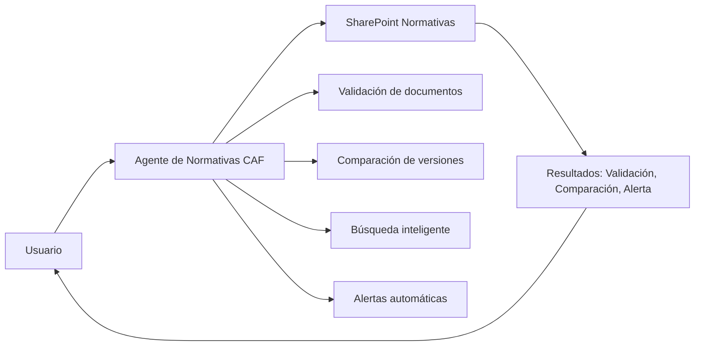
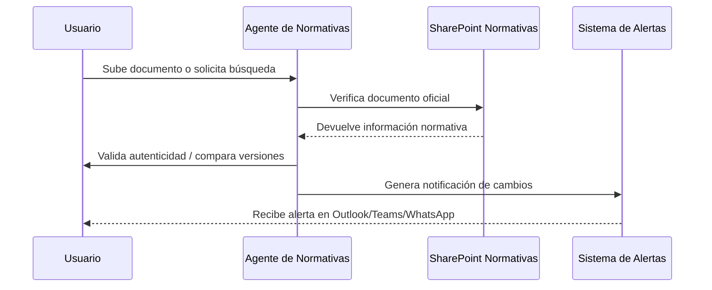

<p align="center">
  
</p>

# 🤖 Agente de Normativas CAF


> El **Agente de Normativas CAF** es una solución desarrollada en **Copilot Studio** para facilitar la interacción con el sistema normativo institucional de CAF, validando, comparando y monitoreando documentos oficiales.

---

👉 **Si quieres descargar un agente y editarlo en tu propio Copilot Studio**, por favor escribe a [innovacion@caf.com](mailto:innovacion@caf.com).  
El equipo de Innovación te compartirá los archivos y la configuración necesarios.

---

## 📹 Demo rápida (Prueba del Agente)

* **Agente**:  
https://teams.microsoft.com/l/app/f6405520-7907-4464-8f6e-9889e2fb7d8f?templateInstanceId=b92e89ba-e531-448c-b9a6-79f55c31e3cb&environment=Default-863e38af-aa47-45c7-a525-20465c654244

---

## 🧭 Tabla de contenidos

- [¿Qué hace el Agente de Normativas CAF?](#que-hace-el-agente-de-normativas-caf)
- [Historia y desarrollo](#historia-y-desarrollo)
- [Arquitectura y funcionamiento](#arquitectura-y-funcionamiento)
- [Guía de prompts](#guia-de-prompts)
- [Pruebas y calidad](#pruebas-y-calidad)
- [FAQ](#faq)
- [Licencia](#licencia)

---

## 🧩 ¿Qué hace el Agente de Normativas CAF?
<a id="que-hace-el-agente-de-normativas-caf"></a>

* **Valida documentos normativos** alojados en SharePoint.  
* **Compara versiones** para detectar cambios no autorizados.  
* Realiza **búsquedas inteligentes** (palabras clave, fechas, autores).  
* Genera **alertas automáticas** ante modificaciones en archivos normativos.  
* Verifica **autenticidad e integridad** de documentos.  
* Recibe **archivos externos** (PDF, Word, texto) y los compara con los contenidos oficiales.  

---

## 🛠️ Historia y desarrollo
<a id="historia-y-desarrollo"></a>

* Propuesto como parte de la iniciativa de **empaquetamiento de agentes institucionales**, liderada por **Jean Rosa (consultor externo)** y **Braulio Salazar**.  
* Documentado en *Paso a paso Prompts*, donde se definieron comportamiento, objetivos y fuentes.  
* Especificado en documentos técnicos como *CAF_Plantilla_Especificacion_Funcional_UC_AgenteCopilot_20250716* y *CAF_Plantilla_Especificacion_Funcional_UC_AgenteCopilot_20250808*.  

---

## 🧠 ¿Qué lo hace especial?

* **Alta trazabilidad**: detecta cualquier modificación no autorizada.  
* **Cumplimiento normativo**: alineado con los lineamientos del sistema normativo (LN-001).  
* **Seguridad robusta**: control de acceso, validación de usuarios, cifrado y auditoría.  
* **Escalabilidad**: puede replicarse en otras áreas que gestionen documentos regulados.  

---

## 🛠️ Arquitectura y funcionamiento
<a id="arquitectura-y-funcionamiento"></a>

### Vista general



### Secuencia



---

## ✍️ Guía de prompts
<a id="guia-de-prompts"></a>

* **Rol del sistema**: Agente institucional para validación y control normativo.  
* **Rol del usuario**: Consulta documentos normativos o sube archivos externos.  
* **Restricciones**:  
  * Solo responder con documentos oficiales de SharePoint.  
  * Validar usuario autorizado antes de enviar alertas.  

**Plantilla ejemplo de prompt utilizado:**

```md
Eres el Agente de Normativas CAF.
Objetivo: validar, comparar y monitorear documentos normativos.
Formato: devolver resultados claros y auditables (validación, diferencias, alertas).
Fuentes: SharePoint Normativas y documentos institucionales.
```

---

## ✅ Pruebas y calidad
<a id="pruebas-y-calidad"></a>

* **Pruebas de validación** con documentos LN-001, MN-038, MN-058, MN-064, MN-049.  
* **Revisión de seguridad**: control de acceso y cifrado de datos.  
* **Casos de prueba**: detección de cambios en versiones históricas, envío de alertas por correo y Teams.  
* **Validación manual** por **Jean Rosa** y equipo normativo.  

---


---

## ❓ FAQ
<a id="faq"></a>

**¿Qué documentos procesa el agente?**  
Archivos normativos de SharePoint y documentos externos (Word, PDF, TXT).  

**¿Cómo detecta cambios no autorizados?**  
Comparando versiones y metadatos con los oficiales en SharePoint.  

**¿Dónde se guarda la información?**  
En **SharePoint Normativas** y sistemas de auditoría de CAF.  

---

## 📄 Licencia
<a id="licencia"></a>

Este proyecto está bajo la licencia **MIT**. Consulta `LICENSE`.  

---

### Créditos

Hecho con ❤️ por Jean Rosa y Braulio Salazar, equipo de Normativas CAF.
