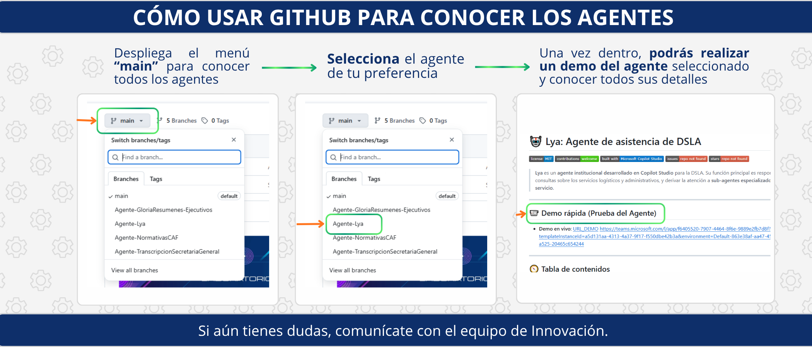
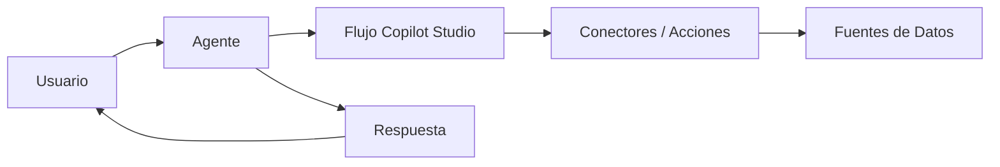

  
  

# 🤖 Repositorio de Agentes en Copilot Studio

 
 
 
 

---

## 📌 ¿Qué es este repositorio?

Este repositorio centraliza todos los **agentes desarrollados en Microsoft Copilot Studio**.  
Cada agente vive en su **propia rama** y contiene:

- 📄 Una descripción clara de lo que hace.  
- 🔗 Un **link para probarlo directamente**.  
- 📝 Ejemplos de uso y buenas prácticas.  

👉 Si quieres **descargar un agente y editarlo en tu propio Copilot Studio**, por favor escribe a **innovacion@caf.com**. El equipo de Innovación te compartirá los archivos y la configuración necesarios.  

---

## 🧭 Cómo navegar entre los agentes

1. Abre el menú de ramas en GitHub (arriba a la izquierda, junto al botón verde “Code”).  
2. Selecciona la **rama** del agente que quieras explorar (`lya`, `agente-x`, etc.).  
3. Dentro de esa rama encontrarás:
   - Un **README específico** con su descripción.  
   - Un **enlace para probarlo** en línea.  
   - Ejemplos de preguntas y respuestas.  
   - Guías de prompts.  

💡 *Tip*: Cambia de rama para comparar diferentes agentes.  

---

## 🛠️ Arquitectura general

Hecho con ❤️ por Raymond y colaboradores de la comunidad.
