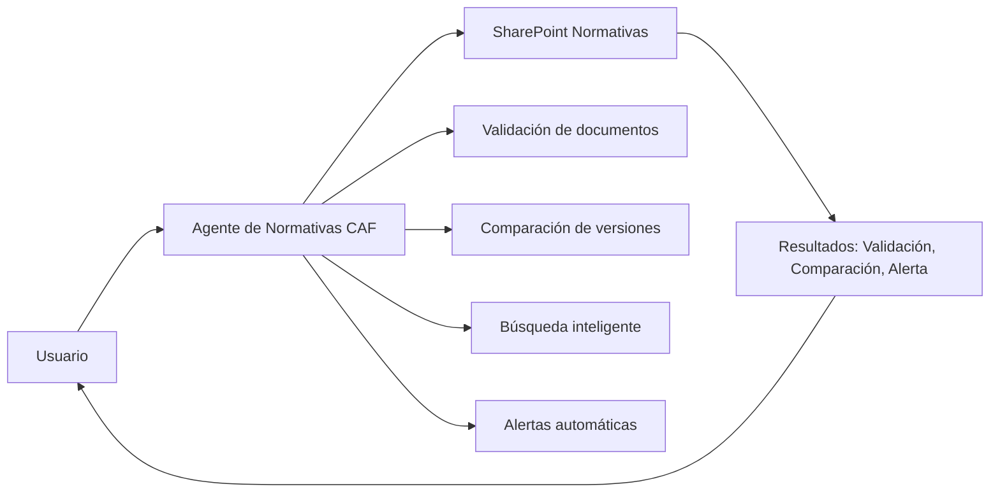
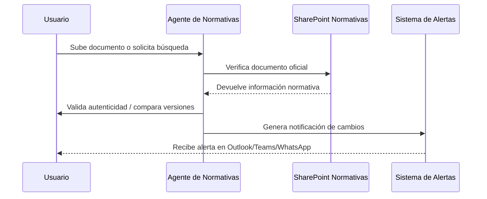

<p align="center">
  
</p>

# 🤖 Agente de Normativas CAF


> El **Agente de Normativas CAF** es una solución desarrollada en **Copilot Studio** para facilitar la interacción con el sistema normativo institucional de CAF, validando, comparando y monitoreando documentos oficiales.

---

## 📹 Demo rápida (Prueba del Agente)

* **Demo en vivo**: ()https://teams.microsoft.com/l/app/f6405520-7907-4464-8f6e-9889e2fb7d8f?templateInstanceId=b92e89ba-e531-448c-b9a6-79f55c31e3cb&environment=Default-863e38af-aa47-45c7-a525-20465c654244

---

## 🧭 Tabla de contenidos

* [¿Qué hace el Agente de Normativas CAF?](#-qué-hace-el-agente-de-normativas-caf)
* [Historia y desarrollo](#-historia-y-desarrollo)
* [Arquitectura y funcionamiento](#-arquitectura-y-funcionamiento)
* [Guía de prompts](#-guía-de-prompts)
* [Pruebas y calidad](#-pruebas-y-calidad)
* [Roadmap](#-roadmap)
* [Contribuir](#-contribuir)
* [FAQ](#-faq)
* [Licencia](#-licencia)

---

## 🧩 ¿Qué hace el Agente de Normativas CAF?

* **Valida documentos normativos** alojados en SharePoint.  
* **Compara versiones** para detectar cambios no autorizados.  
* Realiza **búsquedas inteligentes** (palabras clave, fechas, autores).  
* Genera **alertas automáticas** ante modificaciones en archivos normativos.  
* Verifica **autenticidad e integridad** de documentos.  
* Recibe **archivos externos** (PDF, Word, texto) y los compara con los contenidos oficiales.  

---

## 🛠️ Historia y desarrollo

* Propuesto como parte de la iniciativa de **empaquetamiento de agentes institucionales**, liderada por **Jean Rosa (consultor externo)** y **Braulio Salazar**.  
* Documentado en *Paso a paso Prompts*, donde se definieron comportamiento, objetivos y fuentes.  
* Especificado en documentos técnicos como *CAF_Plantilla_Especificacion_Funcional_UC_AgenteCopilot_20250716* y *CAF_Plantilla_Especificacion_Funcional_UC_AgenteCopilot_20250808*.  

---

## 🧠 ¿Qué lo hace especial?

* **Alta trazabilidad**: detecta cualquier modificación no autorizada.  
* **Cumplimiento normativo**: alineado con los lineamientos del sistema normativo (LN-001).  
* **Seguridad robusta**: control de acceso, validación de usuarios, cifrado y auditoría.  
* **Escalabilidad**: puede replicarse en otras áreas que gestionen documentos regulados.  

---

## 🛠️ Arquitectura y funcionamiento

### Vista general



### Secuencia



---

## ✍️ Guía de prompts

* **Rol del sistema**: Agente institucional para validación y control normativo.  
* **Rol del usuario**: Consulta documentos normativos o sube archivos externos.  
* **Restricciones**:  
  * Solo responder con documentos oficiales de SharePoint.  
  * Validar usuario autorizado antes de enviar alertas.  

**Plantilla ejemplo de prompt utilizado:**

```md
Eres el Agente de Normativas CAF.
Objetivo: validar, comparar y monitorear documentos normativos.
Formato: devolver resultados claros y auditables (validación, diferencias, alertas).
Fuentes: SharePoint Normativas y documentos institucionales.
```

---

## ✅ Pruebas y calidad

* **Pruebas de validación** con documentos LN-001, MN-038, MN-058, MN-064, MN-049.  
* **Revisión de seguridad**: control de acceso y cifrado de datos.  
* **Casos de prueba**: detección de cambios en versiones históricas, envío de alertas por correo y Teams.  
* **Validación manual** por **Jean Rosa** y equipo normativo.  

---

## 🗺️ Roadmap

* [ ] Integración con buzón de correo para alertas normativas.  
* [ ] Expansión hacia áreas de compras y contrataciones.  
* [ ] Dashboard de seguimiento de cambios normativos.  
* [ ] Capacitación a usuarios clave en el uso del agente.  

---

## 🤝 Contribuir

1. Haz un *fork* y crea rama: `feature/mi-mejora`  
2. Asegúrate que las pruebas pasan  
3. Abre un *Pull Request* con descripción y ejemplos  

---

## ❓ FAQ

**¿Qué documentos procesa el agente?**  
Archivos normativos de SharePoint y documentos externos (Word, PDF, TXT).  

**¿Cómo detecta cambios no autorizados?**  
Comparando versiones y metadatos con los oficiales en SharePoint.  

**¿Dónde se guarda la información?**  
En **SharePoint Normativas** y sistemas de auditoría de CAF.  

---

## 📄 Licencia

Este proyecto está bajo la licencia **MIT**. Consulta `LICENSE`.  

---

### Créditos

Hecho con ❤️ por Jean Rosa y Braulio Salazar el equipo de Normativas CAF.
