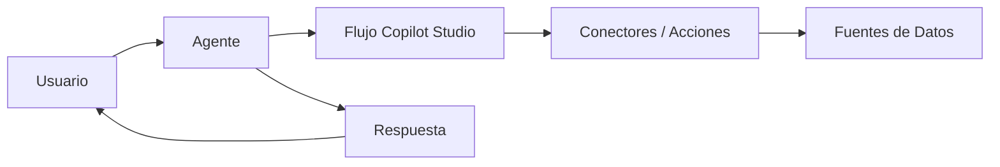

# 🤖 Repositorio de Agentes en Copilot Studio


> Este repositorio centraliza todos los **agentes desarrollados en Microsoft Copilot Studio**. Cada agente cuenta con su propio directorio, documentación, ejemplos y flujos exportables en JSON para facilitar su despliegue y colaboración.

---

## 🧭 Tabla de contenidos

* [¿Qué es este repositorio?](#-qué-es-este-repositorio)
* [Estructura del repositorio](#-estructura-del-repositorio)
* [Agentes incluidos](#-agentes-incluidos)
* [Cómo empezar](#-cómo-empezar)
* [Arquitectura general](#-arquitectura-general)
* [Guía de prompts](#-guía-de-prompts)
* [Despliegue en Copilot Studio](#-despliegue-en-copilot-studio)
* [Pruebas y calidad](#-pruebas-y-calidad)
* [Roadmap](#-roadmap)
* [Contribuir](#-contribuir)
* [Licencia](#-licencia)

---

## 📌 ¿Qué es este repositorio?

Un espacio abierto y colaborativo para:

* Documentar agentes creados en **Copilot Studio**.
* Compartir flujos y ejemplos reutilizables.
* Facilitar la replicación de agentes en otras instituciones.
* Impulsar estándares de calidad en agentes conversacionales.

---

## 🗂️ Estructura del repositorio

```text
.
├─ agents/                       # directorio principal de agentes
│  ├─ lya/                        # agente institucional DSLA
│  │  ├─ flows/                   # flujos exportados de Copilot Studio (JSON)
│  │  ├─ prompts/                 # prompts del sistema/usuario
│  │  ├─ examples/                # entradas y salidas de ejemplo
│  │  ├─ tests/                   # pruebas unitarias/contrato
│  │  └─ README.md                # doc específica del agente
│  └─ <otro-agente>/
├─ docs/                          # guías y documentación general
├─ media/                         # imágenes, diagramas, gifs
├─ scripts/                       # scripts de soporte (ejecución, validación)
├─ .github/workflows/             # CI/CD
├─ LICENSE
└─ README.md                      # este archivo
```

---

## 🤖 Agentes incluidos

* **Lya (AI-DSLA-01)** — Asistente institucional de la DSLA, responde consultas sobre servicios logísticos y administrativos, y deriva a sub-agentes por servicio.
* *(Próximamente: más agentes a documentar)*

---

## ⏱️ Cómo empezar

```bash
# 1) Clona el repo
git clone https://github.com/OWNER/REPO.git
cd REPO

# 2) Explora los agentes
tree agents/

# 3) Abre el agente que quieras probar
code agents/lya/
```

---

## 🛠️ Arquitectura general



---

## ✍️ Guía de prompts

Cada agente tiene su propia guía en `/agents/<nombre>/prompts/`.
Se recomienda incluir:

* Rol del sistema (objetivo, tono, restricciones).
* Rol del usuario (input esperado).
* Ejemplos de I/O (criterios de aceptación).

---

## 🚀 Despliegue en Copilot Studio

1. Importa los flujos JSON desde `/agents/<nombre>/flows/`.
2. Configura conectores necesarios (ej. SharePoint, Dataverse, OneDrive).
3. Prueba en *Test Canvas*.
4. Publica y comparte en canal (Teams, Web).

---

## ✅ Pruebas y calidad

* **Pruebas de contrato**: garantizan consistencia en el formato de salida.
* **Snapshots de respuestas**: detectan cambios no deseados.
* **Linting y link-check**: integrados en GitHub Actions.

---

## 🗺️ Roadmap

* [ ] Añadir más agentes institucionales y técnicos.
* [ ] Publicar *cookbooks* de prompts reutilizables.
* [ ] Incluir métricas de calidad de agentes.
* [ ] Crear scripts de validación automática.

---

## 🤝 Contribuir

1. Haz un *fork* y crea una rama: `feature/mi-mejora`
2. Asegúrate de que las pruebas pasan
3. Abre un *Pull Request* con descripción clara y ejemplos

---

## 📄 Licencia

Este proyecto está bajo la licencia **MIT**. Consulta `LICENSE`.

---

### Créditos

Hecho con ❤️ por Raymond y colaboradores de la comunidad.
