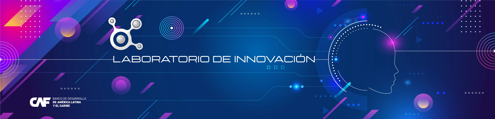
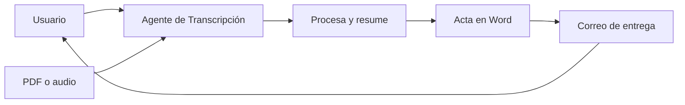
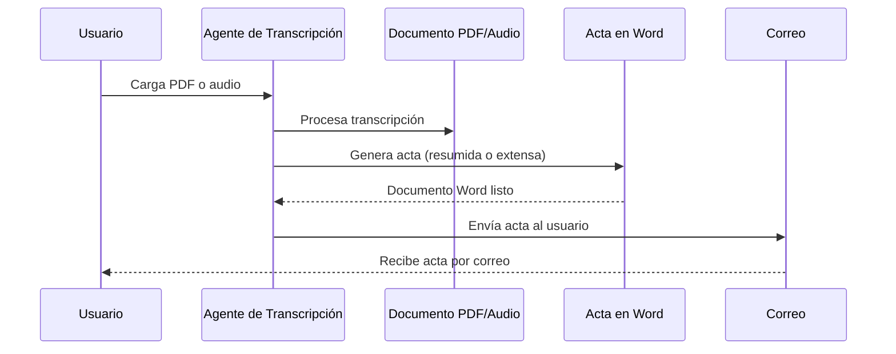

<p align="center">
  
</p>

# 🤖 Agente de Transcripción para la Secretaría General


> El **Agente de Transcripción** fue diseñado para **automatizar la generación de actas** a partir de transcripciones de reuniones, optimizando el trabajo de la **Secretaría General** y facilitando el llenado de **plantillas de cooperación técnica**.

---

## 📹 Demo rápida (Prueba del Agente)

* **Demo en vivo**: (https://teams.microsoft.com/l/app/f6405520-7907-4464-8f6e-9889e2fb7d8f?templateInstanceId=a69288bb-8e4f-48f4-bb7e-be488cd961f9&environment=Default-863e38af-aa47-45c7-a525-20465c654244)

---

## 🧭 Tabla de contenidos

* [¿Qué hace el Agente?](#-qué-hace-el-agente)
* [Historia y desarrollo](#-historia-y-desarrollo)
* [Arquitectura y funcionamiento](#-arquitectura-y-funcionamiento)
* [Guía de prompts](#-guía-de-prompts)
* [Pruebas y calidad](#-pruebas-y-calidad)
* [Roadmap](#-roadmap)
* [Contribuir](#-contribuir)
* [FAQ](#-faq)
* [Licencia](#-licencia)

---

## 🧩 ¿Qué hace el Agente?

* Transcribe reuniones desde **archivos PDF o directamente desde Teams**.  
* Genera **actas automáticas en formato Word**, listas para revisión.  
* Permite ajustar el nivel de detalle: **resumido o extenso**.  
* Llena plantillas de cooperación técnica a partir de documentos institucionales las Actas del las reuniones de la Secretaría General.
* Envía resultados por correo, incluso a cuentas externas como **Gmail**.  

---

## 🛠️ Historia y desarrollo

* Iniciado por **Raymond Arteaga (pasante)** en colaboración con **Héctor Cucumides**.  
* Discutido y validado en reuniones como *Agente de Transcripción* y *Agente de Transcripción 3*.  
* Se realizaron pruebas con **transcripciones reales** y se ajustó el flujo para cumplir con los estándares de la Secretaría General.  
* Se propuso una versión doble del agente:  
  * **Acta resumida**.  
  * **Acta detallada**.  
* Supervisado y validado también por **Braulio Salazar**.  

---

## 🧠 ¿Qué lo hace especial?

* **Automatiza** tareas que antes requerían horas de trabajo manual.  
* Se adapta a las **políticas de seguridad organizacional** (uso de Webex, Teams, OneDrive).  
* Permite **comparar transcripciones entre plataformas** (Webex vs Teams).  
* Facilita el trabajo de áreas como la **Secretaría General** y **Cooperación Técnica**.  

---

## 🛠️ Arquitectura y funcionamiento

### Vista general


```mermaid
flowchart LR
    U[Usuario] --> A[Agente de Transcripción]
    U2[PDF o audio] --> A
    A --> P[Procesa y resume]
    P --> W[Acta en Word]
    W --> C[Correo de entrega]
    C --> U
```

### Secuencia


```mermaid
sequenceDiagram
    participant Usuario
    participant Agente as Agente de Transcripción
    participant PDF as Documento PDF/Audio
    participant Word as Acta en Word
    participant Email as Correo

    Usuario->>Agente: Carga PDF o audio
    Agente->>PDF: Procesa transcripción
    Agente->>Word: Genera acta (resumida o extensa)
    Word-->>Agente: Documento Word listo
    Agente->>Email: Envía acta al usuario
    Email-->>Usuario: Recibe acta por correo
```

---

## ✍️ Guía de prompts

* **Rol del sistema**: Agente institucional para transcripción y generación de actas.  
* **Rol del usuario**: Carga documentos o solicita acta.  
* **Restricciones**:  
  * Máximo **50 páginas** por documento.  
  * Solo formatos **PDF o TXT**.  
  * Validación de campos como fechas y participantes.  

**Plantilla ejemplo de prompt utilizado:**

```md
Eres el agente de transcripción para la Secretaría General.
Objetivo: generar actas automáticas y llenar plantillas de CT.
Formato: Word institucional, ajustable en nivel de detalle.
Fuentes: PDF de transcripción, plantilla institucional.
```

---

## ✅ Pruebas y calidad

* **Pruebas realizadas** con documentos reales y audios de reuniones.  
* **Validación de resultados** por Héctor Cucumides y Braulio Salazar.  
* **Ajustes técnicos** para mejorar el envío por correo y compatibilidad con OneDrive.  

---

## 🗺️ Roadmap

* [ ] Integrar transcripción directa desde **Teams Premium**.  
* [ ] Añadir opción de **traducción automática**.  
* [ ] Mejorar compatibilidad con **Webex**.  
* [ ] Crear **dashboard de seguimiento** de actas generadas.  

---

## 🤝 Contribuir

1. Haz un *fork* y crea rama: `feature/mi-mejora`  
2. Asegúrate que las pruebas pasan  
3. Abre un *Pull Request* con descripción y ejemplos  

---

## ❓ FAQ

**¿Qué tipo de documentos procesa el agente?**  
PDFs con transcripciones de reuniones, archivos TXT y plantillas de CT.  

**¿Puede generar actas automáticamente?**  
Sí, en formato Word, con opción de envío por correo.  

**¿Dónde se guarda la información?**  
En **OneDrive institucional** y en **Copilot Studio**.  

---

## 📄 Licencia

Este proyecto está bajo la licencia **MIT**. Consulta `LICENSE`.  

---

### Créditos

Hecho con ❤️ por Raymond Arteaga, en colaboración con Héctor Cucumides y Braulio Salazar.
