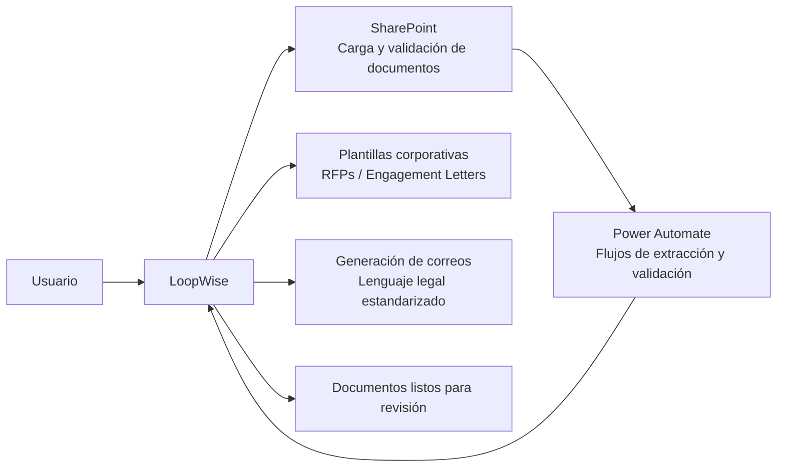
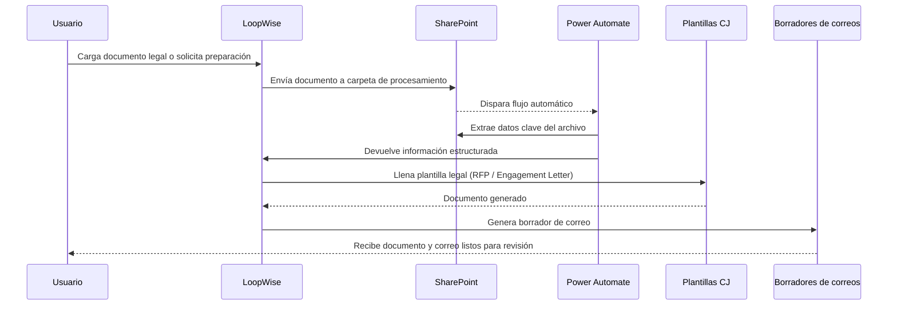

<p align="center">
  
</p>

# 🤖 LoopWise: Agente para Automatización Legal en Consultoría Jurídica (CJ)


> **LoopWise** es un **agente institucional desarrollado en Copilot Studio** para la Dirección de Consultoría Jurídica (CJ).  
Su propósito es **automatizar la generación de documentos legales**, estandarizar comunicaciones y reducir tiempos en la preparación de engagement letters, RFPs y retainer agreements.

---

👉 **Si quieres descargar un agente y editarlo en tu propio Copilot Studio**, por favor escribe a [innovacion@caf.com](mailto:innovacion@caf.com).  
El equipo de Innovación te compartirá los archivos y la configuración necesarios.

---

## 🧭 Tabla de contenidos

- [¿Qué hace LoopWise?](#que-hace-loopwise)
- [Contexto y necesidad](#contexto-y-necesidad)
- [Historia y desarrollo](#historia-y-desarrollo)
- [Arquitectura y funcionamiento](#arquitectura-y-funcionamiento)
- [Guía de prompts](#guia-de-prompts)
- [Pruebas y calidad](#pruebas-y-calidad)
- [FAQ](#faq)
- [Licencia](#licencia)

---

## 🧩 ¿Qué hace LoopWise?
<a id="que-hace-loopwise"></a>

### 🔍 Extracción automática de datos legales
LoopWise identifica y estructura información clave de propuestas y documentos jurídicos:

- Partes involucradas  
- Alcance del servicio  
- Honorarios  
- Plazos y condiciones  

### 📝 Generación automática de documentos legales
El agente completa plantillas corporativas y genera:

- **Engagement letters**  
- **RFPs**  
- **Retainer agreements**

Los documentos quedan listos para revisión del abogado responsable.

### ✉️ Generación de correos corporativos
LoopWise produce borradores de correos estandarizados para:

- Solicitud o envío de engagement letters  
- Peticiones formales de RFPs  
- Comunicaciones legales internas o externas  

### 🛡️ Consistencia jurídica
Mantiene lenguaje corporativo unificado y reduce retrabajo en la preparación de documentos legales.

---

## 🧠 Contexto y necesidad
<a id="contexto-y-necesidad"></a>

**Situación previa:**  
Los abogados debían revisar manualmente documentos extensos para extraer pocos datos críticos y luego transcribirlos en plantillas estándar.  
Esto generaba:

- Consumo excesivo de tiempo  
- Errores por transcripción  
- Variaciones entre abogados  

**Necesidad:**  
Automatizar la extracción de información y la generación de documentos legales, garantizando consistencia y reducción de errores.

Documentos base: *LoopWise 1.pdf*, *LoopWise 3.pdf*.

---

## 🛠️ Historia y desarrollo
<a id="historia-y-desarrollo"></a>

**Responsable técnico:** Christopher Acosta  
**AI Owner:** Sofía Isaza  
**Dirección:** Consultoría Jurídica (CJ)  

**Documentación funcional:**  
- LoopWise 1.pdf  
- LoopWise 3.pdf  

### Reuniones clave
- *LoopWise – Agente IA CJ* — 5 septiembre 2025  
- *LoopWise* — 23 septiembre 2025  
- *LoopWise – Revisión final* — 3 y 24 diciembre 2025  

Sofía Isaza compartió en correos y Teams:  
- Diagramas de flujo  
- Plantillas de documentos  
- Lineamientos de estandarización  

---

## 🧠 ¿Qué lo hace especial?

* Automatiza procesos legales repetitivos  
* Reduce tiempos en preparación de contratos  
* Estandariza lenguaje jurídico  
* Produce documentos y correos listos para revisión  
* Escalable a nuevos procesos legales  

---

## 🛠️ Arquitectura y funcionamiento
<a id="arquitectura-y-funcionamiento"></a>

### Vista general


```mermaid
flowchart LR
    U[Usuario] --> L[LoopWise]
    L --> SP[SharePoint<br>Carga y validación de documentos]
    L --> T[Plantillas corporativas<br>RFPs / Engagement Letters]
    L --> C[Generación de correos<br>Lenguaje legal estandarizado]
    SP --> PA[Power Automate<br>Flujos de extracción y validación]
    PA --> L
    L --> U2[Documentos listos para revisión]
```

---

### Secuencia


```mermaid
sequenceDiagram
    participant Usuario
    participant LoopWise
    participant SP as SharePoint
    participant PA as Power Automate
    participant T as Plantillas CJ
    participant Email as Borradores de correos

    Usuario->>LoopWise: Carga documento legal o solicita preparación
    LoopWise->>SP: Envía documento a carpeta de procesamiento
    SP-->>PA: Dispara flujo automático
    PA->>SP: Extrae datos clave del archivo
    PA->>LoopWise: Devuelve información estructurada
    LoopWise->>T: Llena plantilla legal (RFP / Engagement Letter)
    T-->>LoopWise: Documento generado
    LoopWise->>Email: Genera borrador de correo
    Email-->>Usuario: Recibe documento y correo listos para revisión
```

---

## ✍️ Guía de prompts
<a id="guia-de-prompts"></a>

* **Rol del sistema**: Agente institucional para automatización legal.  
* **Rol del usuario**: Cargar documentos legales o solicitar generación de plantillas.  
* **Restricciones**:
  * Usar únicamente plantillas oficiales de CJ.  
  * Mantener tono jurídico corporativo.  
  * No inventar normativa.  

**Ejemplo de prompt utilizado:**

```md
Eres LoopWise, un agente institucional para automatización legal en Consultoría Jurídica.
Objetivo: extraer datos clave de documentos legales, llenar plantillas corporativas y generar borradores de correos.
Tono: legal, profesional y estandarizado.
Fuentes: Plantillas corporativas CJ y documentos cargados por el usuario.
```

---

## ✅ Pruebas y calidad
<a id="pruebas-y-calidad"></a>

* **Pruebas de extracción**: correcta identificación de partes, honorarios y plazos.  
* **Pruebas de plantillas**: llenado automático de engagement letters y RFPs.  
* **Revisión jurídica**: validación con Sofía Isaza.  
* **Pruebas de comunicaciones**: generación de correos uniformes.  
* **Documentación base:** LoopWise 1.pdf, LoopWise 3.pdf.  

---

## ❓ FAQ
<a id="faq"></a>

**¿Qué documentos procesa LoopWise?**  
Propuestas, engagement letters, RFPs, retainer agreements y documentos legales similares.

**¿Genera documentos automáticamente?**  
Sí, llenando plantillas corporativas con datos extraídos.

**¿Puede generar correos formales?**  
Sí, siguiendo lenguaje institucional estandarizado.

**¿Es escalable?**  
Sí, puede extenderse a otros contratos o procesos legales.

---

## 📄 Licencia
<a id="licencia"></a>

Este proyecto está bajo la licencia **MIT**. Consulta `LICENSE`.

---

### Créditos
Hecho con ❤️ por Christopher Acosta y Sofía Isaza.
