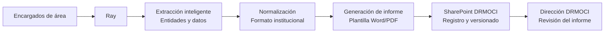
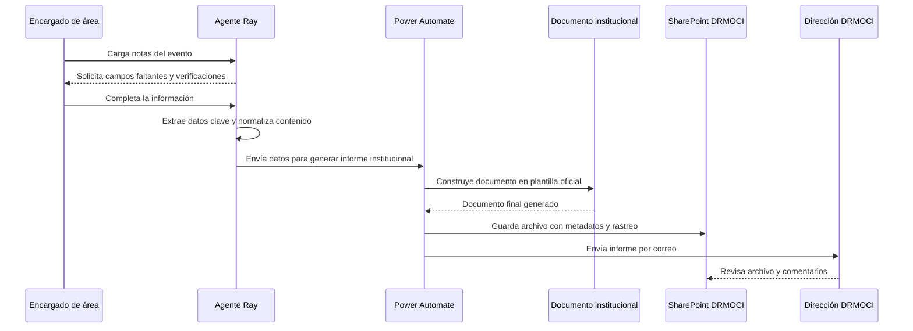

<p align="center">
  
</p>

# 🤖 Ray: Agente Institucional de Reportes de Contingencias y Simulacros  
## Dirección de Riesgo Operacional y Control Interno (DRMOCI)


> **Ray** es un **agente institucional desarrollado en Copilot Studio** para la  
> **Dirección de Riesgo Operacional y Control Interno (DRMOCI)**.  
> Su propósito es **automatizar la generación de reportes institucionales sobre simulacros y contingencias**, a partir de notas cargadas por los responsables de cada área, garantizando estandarización, trazabilidad y eficiencia.

Solicitado por: **Equipo de continuidad de negocio y gestión de contingencias (DRMOCI)**  
Desarrollado por: **Raymond Arteaga – Laboratorio de Innovación CAF**  
Estado: **Entregado y operativo**

---

## 🧭 Tabla de contenidos

- [¿Qué hace Ray?](#que-hace-ray)
- [Contexto y necesidad](#contexto-y-necesidad)
- [Historia y desarrollo](#historia-y-desarrollo)
- [Arquitectura y funcionamiento](#arquitectura-y-funcionamiento)
- [Flujo funcional](#flujo-funcional)
- [Plantilla institucional](#plantilla-institucional)
- [Guía de prompts](#guia-de-prompts)
- [Pruebas y calidad](#pruebas-y-calidad)
- [FAQ](#faq)
- [Licencia](#licencia)

---

## 🧩 ¿Qué hace Ray?
<a id="que-hace-ray"></a>

### 📝 Carga de notas
Los encargados suben sus reportes de simulacros y contingencias en cualquier formato común:

- Texto libre  
- Word (.docx)  
- PDF  
- Notas copiadas desde correo  

Ray guía al usuario para asegurar que la información esté completa.

### 🧠 Extracción inteligente
El agente identifica automáticamente:

- Tipo de evento (simulacro, contingencia real, prueba técnica)  
- Fecha y hora  
- Área involucrada  
- Responsable  
- Acciones ejecutadas  
- Desarrollo del evento  
- Resultados y hallazgos  
- Acciones correctivas y preventivas (CAPA)  

### 🧩 Normalización
Convierte datos heterogéneos en un **formato institucional estandarizado** definido por DRMOCI.

### 📄 Generación del informe institucional
Produce automáticamente:

- **Resumen ejecutivo**  
- **Indicadores clave**  
- **Cronología del evento**  
- **Hallazgos y desviaciones**  
- **Acciones CAPA**  
- **Conclusiones y recomendaciones**  
- **Anexos (fotos, vídeos, documentos)**  

### ✔️ Validación
Antes de emitir el informe, Ray:

- Verifica campos obligatorios  
- Confirma coherencia temporal  
- Identifica ausencias  
- Garantiza tono institucional  

### 🚀 Entrega y trazabilidad
Ray:

- Genera el informe en **plantilla institucional Word/PDF**  
- Lo guarda en **SharePoint**  
- Envía copia automática a la Dirección DRMOCI mediante Power Automate  

---

## 🧠 Contexto y necesidad
<a id="contexto-y-necesidad"></a>

Antes de Ray:

- Cada área redactaba notas en formatos distintos  
- La consolidación manual tomaba horas o días  
- Había riesgo de inconsistencia y pérdida de información  
- No existía un mecanismo estándar de reporte

Con Ray:

- Se automatiza la consolidación  
- Se estandariza el documento institucional  
- Se evita el retrabajo  
- Se asegura trazabilidad mediante SharePoint  

Este enfoque está alineado con buenas prácticas revisadas en sesiones internas de **plantillas, orquestación de agentes y reportes institucionales**.

---

## 🛠️ Historia y desarrollo
<a id="historia-y-desarrollo"></a>

El desarrollo incluyó:

- Revisión de necesidades con el equipo DRMOCI  
- Diseño de prompts guiados para los encargados de área  
- Incorporación de validaciones automáticas  
- Creación de plantilla institucional con secciones estandarizadas  
- Conexión con **Power Automate** para generar informes  
- Integración con **SharePoint** para trazabilidad  
- Pruebas con datos reales de simulacros y eventos

Discusión adicional:

- Incorporar gráficos automáticos en el futuro (por trimestre, por sede, etc.)  

---

## 🧠 ¿Qué lo hace especial?

* Automatiza una tarea operativa crítica  
* Elimina consolidación manual  
* Asegura homogeneidad en todos los reportes  
* Provee trazabilidad completa en SharePoint  
* Escalable a múltiples tipos de reportes de continuidad de negocio  

---

## 🛠️ Arquitectura y funcionamiento
<a id="arquitectura-y-funcionamiento"></a>

### Vista general


```mermaid
flowchart LR
    U[Encargados de área] --> R[Ray]
    R --> E[Extracción inteligente<br>Entidades y datos]
    E --> N[Normalización<br>Formato institucional]
    N --> W[Generación de informe<br>Plantilla Word/PDF]
    W --> SP[SharePoint DRMOCI<br>Registro y versionado]
    SP --> D[Dirección DRMOCI<br>Revisión del informe]
```

---

### Secuencia


```mermaid
sequenceDiagram
    participant Encargado as Encargado de área
    participant Ray as Agente Ray
    participant PA as Power Automate
    participant Word as Documento institucional
    participant SP as SharePoint DRMOCI
    participant Direccion as Dirección DRMOCI

    Encargado->>Ray: Carga notas del evento
    Ray-->>Encargado: Solicita campos faltantes y verificaciones
    Encargado->>Ray: Completa la información
    Ray->>Ray: Extrae datos clave y normaliza contenido
    Ray->>PA: Envía datos para generar informe institucional
    PA->>Word: Construye documento en plantilla oficial
    Word-->>PA: Documento final generado
    PA->>SP: Guarda archivo con metadatos y rastreo
    PA->>Direccion: Envía informe por correo
    Direccion-->>SP: Revisa archivo y comentarios
```

---

## 🧱 Flujo funcional
<a id="flujo-funcional"></a>

1. **Carga de notas**  
2. **Extracción automática de entidades y datos clave**  
3. **Normalización según plantilla institucional**  
4. **Validaciones corporativas (coherencia + completitud)**  
5. **Generación de reporte Word/PDF**  
6. **Registro en SharePoint con metadatos**  
7. **Envío automático para revisión**  

---

## 🧾 Plantilla institucional
<a id="plantilla-institucional"></a>

La plantilla del informe incluye:

- Portada del evento  
- Resumen ejecutivo  
- Ficha técnica del simulacro/contingencia  
- Cronología detallada  
- Hallazgos y desviaciones  
- Indicadores clave:
  - Participación  
  - Tiempo de evacuación / control  
  - Cumplimiento de protocolo  
- Acciones CAPA  
- Lecciones aprendidas  
- Recomendaciones  
- Anexos (fotos, videos, evidencias)  

---

## ✍️ Guía de prompts
<a id="guia-de-prompts"></a>

### ✔️ Rol del sistema
Agente institucional para consolidación y generación de reportes de simulacros y contingencias.

### ✔️ Rol del usuario
Encargados de área que reportan eventos.

### ✔️ Restricciones
- No inventar información  
- Mantener estilo formal corporativo  
- Solicitar información faltante  
- Validar coherencia temporal y de datos  

**Ejemplo de prompt interno:**

```md
Eres Ray, agente institucional para reportes de simulacros y contingencias.
Tu tarea es extraer información clave de notas cargadas por los responsables,
normalizarla según la plantilla corporativa y generar un informe institucional.
Debes validar campos obligatorios, asegurar claridad y mantener tono formal.
```

---

## 🚀 Pruebas y calidad
<a id="pruebas-y-calidad"></a>

Pruebas realizadas:

- Integración con Power Automate  
- Validación de extracción de información  
- Pruebas con notas reales de contingencias  
- Ensamblado de informes en Word  
- Validación de metadatos en SharePoint  
- Revisión con el equipo DRMOCI  

---

## ❓ FAQ
<a id="faq"></a>

**¿Qué tipo de eventos procesa Ray?**  
Simulacros, contingencias reales y pruebas operativas.

**¿Puede aceptar cualquier formato de nota?**  
Sí: texto, Word, PDF o copia desde correo.

**¿Dónde se guardan los informes?**  
En la biblioteca oficial de SharePoint de DRMOCI.

**¿Incluye indicadores automáticos?**  
Sí, calcula participación, tiempos y hallazgos clave.

**¿Puede escalarse a otros reportes?**  
Sí, puede ampliarse a auditorías internas y continuidad de negocio.

---

## 📄 Licencia
<a id="licencia"></a>

Proyecto bajo licencia **MIT**. Consulta `LICENSE`.

---

### Créditos
Hecho con ❤️ por la **Dirección de Riesgo Operacional y Control Interno (DRMOCI)** y el **Laboratorio de Innovación CAF — Raymond Arteaga**.
