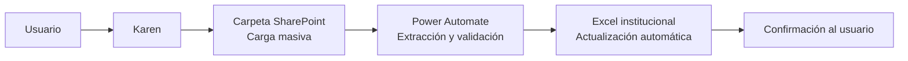
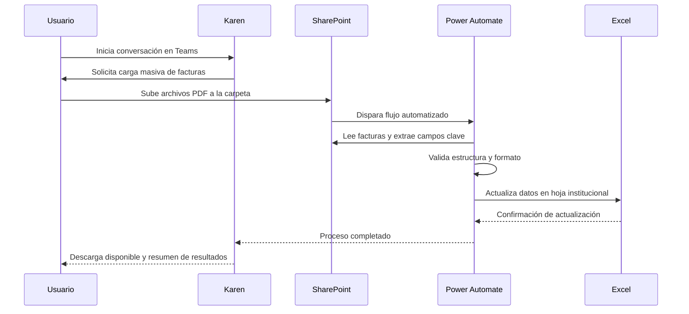

<p align="center">
  
</p>

# 🤖 Karen: Agente de Gestión de Facturas de Viajes


> **Karen** es un **agente institucional desarrollado en Copilot Studio** para automatizar la **gestión de facturas de viajes**, optimizando la carga, validación y consolidación de datos contables en los procesos internos de CAF.

---

👉 **Si quieres descargar un agente y editarlo en tu propio Copilot Studio**, por favor escribe a [innovacion@caf.com](mailto:innovacion@caf.com).  
El equipo de Innovación te compartirá los archivos y la configuración necesarios.

---

## 🧭 Tabla de contenidos

- [¿Qué hace Karen?](#que-hace-karen)
- [Historia y desarrollo](#historia-y-desarrollo)
- [Arquitectura y funcionamiento](#arquitectura-y-funcionamiento)
- [Guía de prompts](#guia-de-prompts)
- [Pruebas y calidad](#pruebas-y-calidad)
- [FAQ](#faq)
- [Licencia](#licencia)

---

## 🧩 ¿Qué hace Karen?
<a id="que-hace-karen"></a>

### 🔍 Extracción automática de datos desde facturas PDF
Karen identifica y estructura campos claves como:

- Número de factura  
- Fecha de emisión  
- Nombre del pasajero  
- Nombre y RUC del emisor  
- Descripción del servicio  
- Total a pagar y moneda  
- Número de CMB  
- Fecha del viaje  
- Medio de pago  
- Observaciones  

### 📂 Carga masiva en SharePoint  
Permite procesar **varias facturas simultáneamente**, facilitando cierres mensuales.

### 📊 Actualización automática en Excel institucional  
Los datos extraídos se reflejan en la hoja contable en **menos de 5 minutos**.

### 🧠 Entrenamiento adaptable  
El flujo reconoce **nuevos formatos de facturas** sin necesidad de reconfigurar el sistema completo.

---

## 🛠️ Historia y desarrollo
<a id="historia-y-desarrollo"></a>

* Karen surge como respuesta a la necesidad del área contable de **agilizar la gestión de facturas de viajes**, un proceso históricamente manual y propenso a errores.  
* El diseño y validación del flujo fue realizado en colaboración con **Karen Castañeda**, quien verificó la mejora significativa en tiempos y precisión.  
* Ajustes incorporados durante el desarrollo:  
  - Reducción de notificaciones por correo.  
  - Acceso directo a carpeta SharePoint para **carga masiva eficiente**.  
* El agente demostró **incremento en eficiencia** y **mejor experiencia de usuario** desde la primera iteración operativa.

---

## 🧠 ¿Qué lo hace especial?

* Automatiza completamente un proceso contable crítico.  
* Reduce drásticamente errores de transcripción.  
* Se adapta a facturas nuevas sin necesidad de rehacer el flujo.  
* Integra nativamente herramientas M365: Teams, SharePoint, Excel y Power Automate.  

---

## 🛠️ Arquitectura y funcionamiento
<a id="arquitectura-y-funcionamiento"></a>

### Vista general


```mermaid
flowchart LR
    U[Usuario] --> K[Karen]
    K --> S[Carpeta SharePoint<br>Carga masiva]
    S --> F[Power Automate<br>Extracción y validación]
    F --> E[Excel institucional<br>Actualización automática]
    E --> U2[Confirmación al usuario]
```

---

### Secuencia


```mermaid
sequenceDiagram
    participant Usuario
    participant Karen
    participant SP as SharePoint
    participant PA as Power Automate
    participant Excel

    Usuario->>Karen: Inicia conversación en Teams
    Karen->>Usuario: Solicita carga masiva de facturas
    Usuario->>SP: Sube archivos PDF a la carpeta
    SP->>PA: Dispara flujo automatizado
    PA->>SP: Lee facturas y extrae campos clave
    PA->>PA: Valida estructura y formato
    PA->>Excel: Actualiza datos en hoja institucional
    Excel-->>PA: Confirmación de actualización
    PA-->>Karen: Proceso completado
    Karen-->>Usuario: Descarga disponible y resumen de resultados
```

---

## ✍️ Guía de prompts
<a id="guia-de-prompts"></a>

* **Rol del sistema**: Agente institucional para automatización contable.  
* **Rol del usuario**: Solicita procesamiento y carga masiva de facturas.  
* **Restricciones**:  
  * Responder únicamente con procesos oficiales del área contable.  
  * Usar exclusivamente la carpeta de SharePoint y el Excel institucional configurados.  

**Plantilla ejemplo del prompt utilizado:**

```md
Eres Karen, un agente institucional para gestión automatizada de facturas de viajes.
Objetivo: guiar al usuario, validar facturas y activar el flujo contable automatizado.
Formato: respuestas claras, institucionales y orientadas al paso a paso.
Fuentes: Carpeta SharePoint oficial y Excel institucional.
```

---

## ✅ Pruebas y calidad
<a id="pruebas-y-calidad"></a>

* **Pruebas funcionales**: extracción correcta de todos los campos contables.  
* **Pruebas con facturas reales**: distintos formatos de agencias y aerolíneas.  
* **Pruebas de rendimiento**: carga masiva y actualización en menos de 5 minutos.  
* **Revisión manual** por el equipo contable y por **Karen Castañeda**.  

---

## ❓ FAQ
<a id="faq"></a>

**¿Qué facturas procesa Karen?**  
Facturas de viajes en formato PDF cargadas a la carpeta SharePoint designada.

**¿Actualiza automáticamente el Excel institucional?**  
Sí, en cada ejecución del flujo.

**¿Puede adaptarse a otros procesos contables?**  
Sí, gracias a su arquitectura modular basada en Power Automate.

**¿Dónde se almacena la información?**  
En **SharePoint institucional** y en el **Excel contable oficial**.

---

## 📄 Licencia
<a id="licencia"></a>

Este proyecto está bajo la licencia **MIT**. Consulta `LICENSE`.

---

### Créditos

Hecho por Raymond Arteaga y Karen Castañeda.
