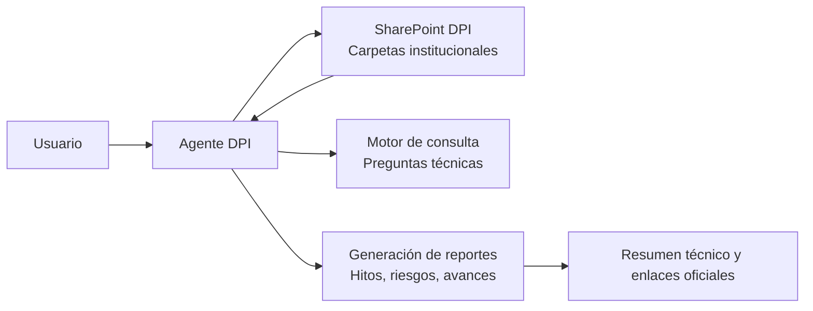
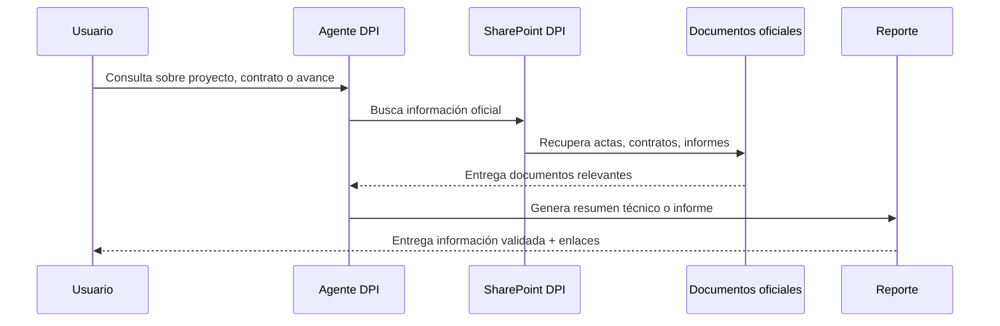

<p align="center">
  
</p>

# 🤖 Agente DPI — Soporte Inteligente para Proyectos de Infraestructura


> El **Agente DPI** es una herramienta institucional desarrollada en **Copilot Studio** para la **Dirección de Proyectos de Infraestructura (DPI)**.  
Fue diseñado para **agilizar la gestión documental, el acceso a información técnica y la generación de reportes** en proyectos de infraestructura complejos.

Solicitado por: **DPI — equipo técnico liderado por Alexandra Gurley**  
Desarrollado por: **Raymond Arteaga (Laboratorio de Innovación CAF)**  
Estado: **Operativo**, conectado a SharePoint y probado en Teams.

---

## 🧭 Tabla de contenidos

- [¿Qué hace el Agente DPI?](#que-hace-el-agente-dpi)
- [Contexto y necesidad](#contexto-y-necesidad)
- [Historia y desarrollo](#historia-y-desarrollo)
- [Arquitectura y funcionamiento](#arquitectura-y-funcionamiento)
- [Guía de prompts](#guia-de-prompts)
- [Pruebas y calidad](#pruebas-y-calidad)
- [FAQ](#faq)
- [Licencia](#licencia)

---

## 🧩 ¿Qué hace el Agente DPI?
<a id="que-hace-el-agente-dpi"></a>

### 🔍 Consulta inteligente
Permite a los usuarios realizar preguntas sobre:

- Proyectos en ejecución  
- Contratos y documentos contractuales  
- Cronogramas, hitos, retrasos y avances  
- Riesgos identificados  
- Informes técnicos  

El agente responde en base a **documentos oficiales** almacenados en SharePoint.

### 📂 Integración con SharePoint
El agente accede a las carpetas institucionales de DPI para:

- Extraer información reciente  
- Validar documentos  
- Asegurar consistencia entre respuestas y fuentes oficiales  

### 📝 Generación de reportes automáticos
Produce informes breves o detallados sobre:

- Estado del proyecto  
- Avances por fase  
- Hitos cumplidos  
- Riesgos detectados  
- Próximos entregables  

Ideal para:

- Comités internos  
- Seguimiento de obra  
- Revisión de consultores  

### 🧠 Validación técnica
El agente incluye prompts internos para:

- Confirmar que los datos provienen de fuentes oficiales  
- Priorizar contratos, actas, informes y minutas  
- Evitar información no verificada  

---

## 🧠 Contexto y necesidad
<a id="contexto-y-necesidad"></a>

Antes del agente DPI:

- Los equipos debían buscar información en múltiples carpetas y versiones de documentos.  
- La consolidación de datos tomaba horas o días.  
- Existía riesgo de usar documentos desactualizados.  

**DPI solicitó un agente que:**

- Consultara información técnica desde SharePoint  
- Generara reportes rápidos para comités  
- Diera acceso inmediato a información oficial  
- Redujera carga manual del equipo técnico  

Confirmado en reuniones y correos internos:  
El agente está **operativo, probado en Teams**, y conectado a SharePoint institucional.

---

## 🛠️ Historia y desarrollo
<a id="historia-y-desarrollo"></a>

- Solicitado por **Alexandra Gutley (DPI)** a través del área de Innovación.  
- Desarrollado por **Raymond Arteaga**, con pruebas del equipo técnico DPI.  
- Validado en sesiones donde se verificó:  
  - Acceso a carpetas SharePoint  
  - Calidad de respuestas técnicas  
  - Formatos de reportes  
  - Integración en Teams  

El agente fue agregado al **catálogo institucional** en la categoría DPI.

---

## 🧠 ¿Qué lo hace especial?

* Busca en documentos oficiales y responde con precisión  
* Genera reportes automáticos para comités  
* Reduce tiempos operativos  
* Asegura transparencia y trazabilidad  
* Se adapta a proyectos viales, energéticos, aeroportuarios y más  

---

## 🛠️ Arquitectura y funcionamiento
<a id="arquitectura-y-funcionamiento"></a>

### Vista general


```mermaid
flowchart LR
    U[Usuario] --> D[Agente DPI]
    D --> SP[SharePoint DPI<br>Carpetas institucionales]
    D --> Q[Motor de consulta<br>Preguntas técnicas]
    D --> R[Generación de reportes<br>Hitos, riesgos, avances]
    SP --> D
    R --> U2[Resumen técnico y enlaces oficiales]
```

---

### Secuencia


```mermaid
sequenceDiagram
    participant Usuario
    participant DPI as Agente DPI
    participant SP as SharePoint DPI
    participant Docs as Documentos oficiales
    participant Reporte

    Usuario->>DPI: Consulta sobre proyecto, contrato o avance
    DPI->>SP: Busca información oficial
    SP->>Docs: Recupera actas, contratos, informes
    Docs-->>DPI: Entrega documentos relevantes
    DPI->>Reporte: Genera resumen técnico o informe
    Reporte-->>Usuario: Entrega información validada + enlaces
```

---

## ✍️ Guía de prompts
<a id="guia-de-prompts"></a>

### ✔️ Rol del sistema
Agente institucional especializado en análisis documental técnico para proyectos de infraestructura.

### ✔️ Rol del usuario
Consultas sobre avances, riesgos, hitos, contratos y documentación.

### ✔️ Restricciones
- Solo responder con información proveniente de SharePoint DPI.  
- Priorizar documentos oficiales: contratos, actas, informes técnicos.  
- No inferir datos no documentados.  

**Ejemplo de prompt interno:**

```md
Eres el Agente DPI, especializado en proyectos de infraestructura.
Tu función es consultar información oficial en SharePoint,
responder preguntas técnicas y generar reportes para comités.
Asegura que toda respuesta cite documentos institucionales.
```

---

## 🚀 Pruebas y calidad
<a id="pruebas-y-calidad"></a>

- Pruebas del equipo técnico de DPI  
- Validación de reportes generados  
- Pruebas de navegación entre carpetas SharePoint  
- Revisión del acceso desde Teams  
- Confirmación del comportamiento técnico por Sofía Isaza  

---

## ❓ FAQ
<a id="faq"></a>

**¿De dónde obtiene la información?**  
De las carpetas oficiales de DPI en SharePoint.

**¿Genera reportes automáticos?**  
Sí, incluyendo estado del proyecto, hitos y riesgos.

**¿Puede responder sobre contratos específicos?**  
Sí, siempre que estén en SharePoint.

**¿Puede adaptarse a otros tipos de proyectos?**  
Totalmente. Es escalable a cualquier proyecto con documentación técnica.

---

## 📄 Licencia
<a id="licencia"></a>

Proyecto bajo licencia **MIT**. Consulta `LICENSE`.

---

### Créditos
Hecho con ❤️ por Laboratorio de Innovación CAF — Raymond Arteaga y el Dirección de Proyectos de Infraestructura (DPI).
