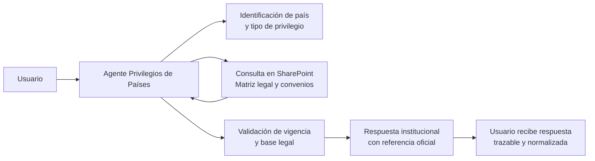
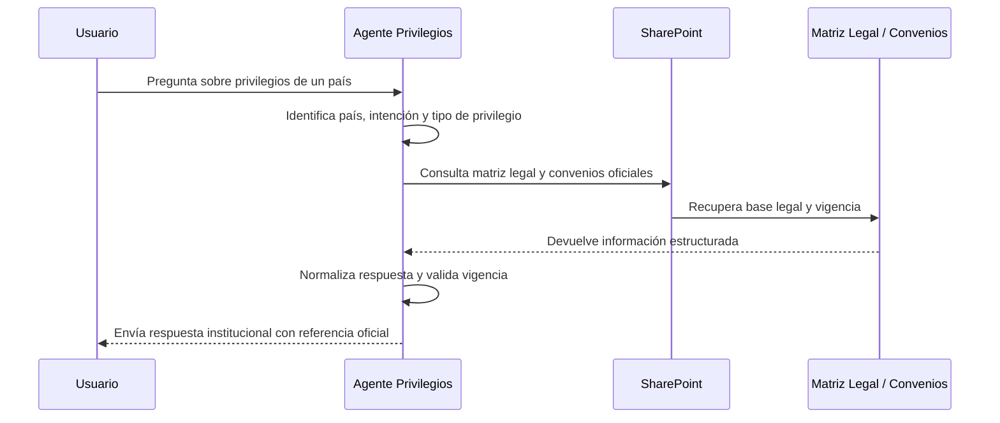

<p align="center">
  
</p>

# 🤖 Agente Privilegios de Países — Secretaría General


> El **Agente Privilegios de Países** es una herramienta institucional desarrollada en **Copilot Studio** para la **Secretaría General**, diseñada para responder consultas en tiempo real sobre **inmunidades, exenciones y privilegios diplomáticos** otorgados a los países accionistas de CAF.  
> Su objetivo es ofrecer **respuestas claras, trazables y normalizadas**, basadas en fuentes oficiales sin requerir carga de documentos por parte del usuario.

Solicitado por:  
- **Anthony Vásquez — Ejecutivo de Inmunidades y Privilegios**  
- **Diego Saltarén — Pasante**  

Desarrollado por: **Raymond Arteaga (PASANTE) — Laboratorio de Innovación CAF**

---

## 🧭 Tabla de contenidos

- [¿Qué hace el agente?](#que-hace-el-agente)
- [Contexto y necesidad](#contexto-y-necesidad)
- [Historia y desarrollo](#historia-y-desarrollo)
- [Arquitectura y funcionamiento](#arquitectura-y-funcionamiento)
- [Guía de prompts](#guia-de-prompts)
- [Pruebas y calidad](#pruebas-y-calidad)
- [FAQ](#faq)
- [Licencia](#licencia)

---

## 🧩 ¿Qué hace el Agente Privilegios de Países?
<a id="que-hace-el-agente"></a>

### 🔍 Responde consultas sobre:
- Privilegios aplicables por país (fiscales, aduaneros, diplomáticos, operativos).  
- Vigencia y estado (activo, vencido, próximo a renovación).  
- Bases legales:
  - Tratados internacionales  
  - Convenios bilaterales  
  - Notas diplomáticas  
  - Resoluciones institucionales  
- Beneficiarios:
  - Misiones  
  - Funcionarios  
  - Bienes importados  
  - Representaciones permanentes  
- Comparativas entre países.  
- Alertas sobre vencimientos (próximos o ya expirados).

### 📘 Respuestas institucionales y trazables
El agente:

- Responde **sin necesidad de cargar documentos**.  
- Accede directamente a la **matriz legal** y **convenios oficiales** en SharePoint.  
- Devuelve respuestas estructuradas con:
  - País  
  - Privilegios aplicables  
  - Base legal  
  - Condiciones  
  - Vigencia  
  - Observaciones  
  - Enlace o referencia a la fuente institucional  

---

## 🧠 Contexto y necesidad
<a id="contexto-y-necesidad"></a>

Antes del agente:

- Las consultas sobre privilegios se respondían revisando manualmente múltiples documentos.  
- Las matrices legales eran extensas y su lectura tomaba tiempo.  
- La información no siempre se presentaba en formato homogéneo.  

Necesidad institucional:

- **Automatizar la búsqueda** de privilegios por país.  
- Garantizar **coherencia y claridad** en las respuestas.  
- Facilitar las tareas del equipo de Inmunidades y Privilegios.  
- Asegurar que el usuario siempre reciba **información oficial y vigente**.

---

## 🛠️ Historia y desarrollo
<a id="historia-y-desarrollo"></a>

El agente fue desarrollado por:

- **Laboratorio de Innovación CAF (Raymond Arteaga)**  
- En coordinación con **Secretaría General**  
- Bajo requerimientos de **Anthony Vásquez** y **Diego Saltarén**

En reuniones y correos se definió:

- Lista de privilegios por país  
- Estructura de las respuestas institucionales  
- Fuentes oficiales en SharePoint  
- Validaciones internas para evitar respuestas fuera del scope  

El agente fue probado en Teams con preguntas reales sobre:

- Países accionistas específicos  
- Condiciones de importación  
- Vigencias de convenios  
- Diferencias entre países  

---

## 🧠 ¿Qué lo hace especial?

* Permite consultas complejas sin cargar documentos  
* Asegura factores clave: base legal, vigencia, condiciones y beneficiarios  
* Mantiene un formato homogéneo y profesional  
* Reduce tiempos de búsqueda manual en convenios y matrices  
* Garantiza trazabilidad con referencias institucionales  
* Escalable para alertas automáticas, comparativas y dashboards  

---

## 🛠️ Arquitectura y funcionamiento
<a id="arquitectura-y-funcionamiento"></a>

### Vista general


```mermaid
flowchart LR
    U[Usuario] --> A[Agente Privilegios de Países]
    A --> N[Identificación de país<br>y tipo de privilegio]
    A --> Q[Consulta en SharePoint<br>Matriz legal y convenios]
    Q --> A
    A --> F[Validación de vigencia<br>y base legal]
    F --> R[Respuesta institucional<br>con referencia oficial]
    R --> U2[Usuario recibe respuesta<br>trazable y normalizada]
```

---

### Secuencia


```mermaid
sequenceDiagram
    participant Usuario
    participant Agente as Agente Privilegios
    participant SP as SharePoint
    participant Doc as Matriz Legal / Convenios

    Usuario->>Agente: Pregunta sobre privilegios de un país
    Agente->>Agente: Identifica país, intención y tipo de privilegio
    Agente->>SP: Consulta matriz legal y convenios oficiales
    SP->>Doc: Recupera base legal y vigencia
    Doc-->>Agente: Devuelve información estructurada
    Agente->>Agente: Normaliza respuesta y valida vigencia
    Agente-->>Usuario: Envía respuesta institucional con referencia oficial
```

---

## ✍️ Guía de prompts
<a id="guia-de-prompts"></a>

### ✔️ Rol del sistema
Agente institucional que responde consultas sobre inmunidades, privilegios y exenciones otorgadas por país, basado exclusivamente en fuentes oficiales.

### ✔️ Rol del usuario
Plantear preguntas relacionadas con:

- Países  
- Privilegios  
- Vigencias  
- Condiciones legales  

### ✔️ Restricciones
- No inventar información  
- No responder sin base documental  
- Citar siempre la fuente institucional  
- Mantener tono formal, claro y homogéneo  

**Ejemplo de prompt interno:**

```md
Eres el Agente Privilegios de Países.
Debes responder únicamente con información proveniente de la matriz legal
y los convenios oficiales guardados en SharePoint.
Todas tus respuestas deben incluir base legal, vigencia y referencia
a la fuente institucional, manteniendo un tono formal y estandarizado.
```

---

## 🚀 Pruebas y calidad
<a id="pruebas-y-calidad"></a>

Pruebas realizadas:

- Preguntas reales sobre países específicos  
- Verificación de vigencias y fechas de renovación  
- Revisión del formato institucional de las respuestas  
- Validación de referencias legales y enlaces a convenios  
- Coordinación con Secretaría General  

---

## ❓ FAQ
<a id="faq"></a>

**¿El agente necesita cargar documentos?**  
No. Trabaja directamente con matrices oficiales en SharePoint.

**¿Puede comparar países?**  
Sí, puede describir diferencias de privilegios entre dos países.

**¿Incluye la base legal siempre?**  
Sí, forma parte obligatoria de cada respuesta.

**¿Detecta vigencias próximas a vencer?**  
Sí, puede alertar sobre vencimientos cercanos.

**¿Puede ampliarse?**  
Sí, permite integrar alertas automáticas y análisis comparativos complejos.

---

## 📄 Licencia
<a id="licencia"></a>

Proyecto bajo licencia **MIT**. Consulta `LICENSE`.

---

### Créditos
Hecho con ❤️ por **Secretaría General**, equipo de Inmunidades y Privilegios, y el **Laboratorio de Innovación CAF — Raymond Arteaga**.
