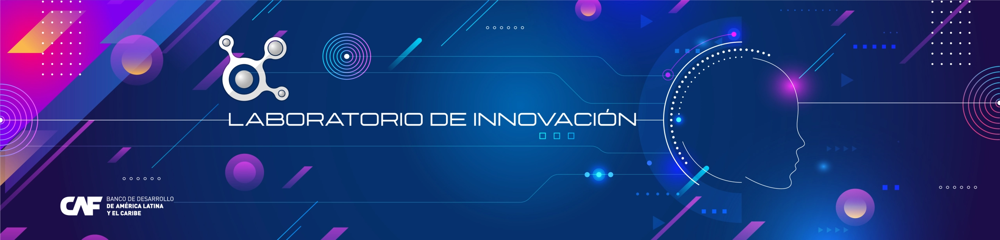
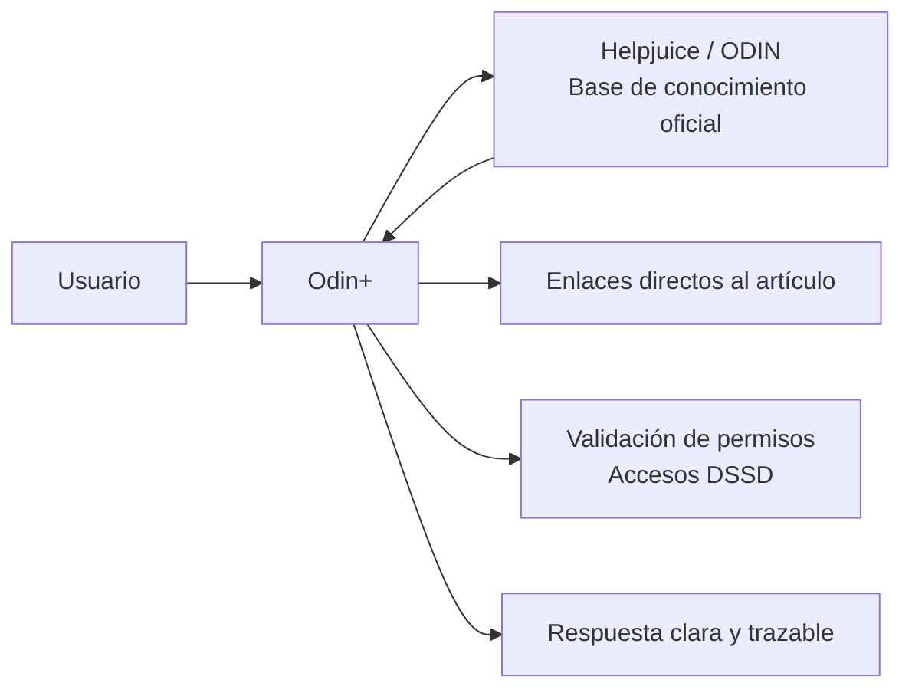
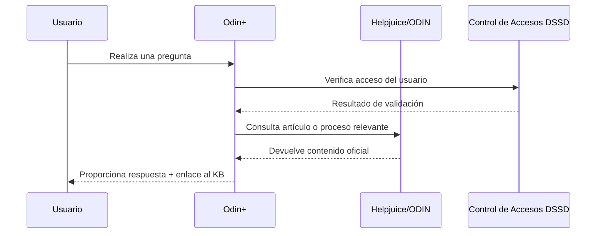

<p align="center">
  
</p>

# 🤖 Odin+: Agente Helpjuice


> **Odin+** es el **agente institucional de la Dirección de Sistemas y Soluciones Digitales (DSSD)** para consultar el conocimiento del **Helpjuice/ODIN** mediante una interfaz conversacional en Copilot Studio.  
Fue diseñado para permitir que usuarios internos encuentren artículos, procedimientos y guías del KB de forma rápida, natural y con enlaces directos a la base de conocimiento.

---

👉 **Para solicitar acceso, instalación o descarga del agente**, por favor escribe a [innovacion@caf.com](mailto:innovacion@caf.com).  

---

## 🧭 Tabla de contenidos

- [¿Qué hace Odin+?](#que-hace-odin)
- [Contexto organizacional](#contexto-organizacional)
- [Historia y desarrollo](#historia-y-desarrollo)
- [Arquitectura y funcionamiento](#arquitectura-y-funcionamiento)
- [Guía de prompts](#guia-de-prompts)
- [Acceso y despliegue](#acceso-y-despliegue)
- [Pruebas y calidad](#pruebas-y-calidad)
- [FAQ](#faq)
- [Licencia](#licencia)

---

## 🧩 ¿Qué hace Odin+?
<a id="que-hace-odin"></a>

### 🔍 Consultas al Knowledge Base (Helpjuice / ODIN)
Odin+ permite que cualquier usuario de DSSD:

- Formule preguntas en lenguaje natural.  
- Obtenga respuestas basadas **únicamente** en la base de conocimiento ODIN/Helpjuice.  
- Reciba enlaces directos a artículos oficiales:  
  **https://odin-kb.helpjuice.com/es_MX**

### 📚 Respuestas controladas y trazables
El agente:

- No improvisa contenido fuera del KB.  
- Garantiza referencias claras al artículo fuente.  
- Mantiene consistencia en terminología y procedimientos institucionales.

### 🔗 Integración con M365 / Teams
El agente se publica en Teams para pruebas y uso interno.  
Los enlaces al agente se compartieron en el hilo **“Integración HelpJuice - Copilot”**.


---

## 🧠 Contexto organizacional
<a id="contexto-organizacional"></a>

**Área responsable:** Dirección de Sistemas y Soluciones Digitales (DSSD)  
**Sponsor / Owner:** TACURI, RENE (CONSULTOR EXTERNO)  
**Coordinación operativa:** Braulio Salazar y Raymond Arteaga  
**Usuarios de prueba:** SEGURA, MARCO y MARQUEZ, ANTONIO

Odin+ reemplaza formalmente el nombre “Agente Helpjuice”.

En el **listado oficial de agentes**, aparece como:

> **Odin+ — Entregado (DSSD)**

---

## 🛠️ Historia y desarrollo
<a id="historia-y-desarrollo"></a>

### Documentos y materiales de referencia
- Diagramas, notas y lineamientos enviados por TACURI, RENE.  
- Conversaciones en Teams de:  
  - Branding del agente  
  - Accesos  
  - Integración con Copilot  
- Archivos internos del KB ODIN/Helpjuice.

### Reuniones y validaciones
- *Integración HelpJuice - Copilot* (varias sesiones)  
- Chats operativos: habilitación de accesos, pruebas y revisión de resultados  
- Actualización del agente en el catálogo institucional de DSSD

Odin+ se consolidó como un agente estable y aprobado institucionalmente.

---

## 🧠 ¿Qué lo hace especial?

* Permite consultas naturales sobre contenido técnico en ODIN/Helpjuice  
* Ahorra tiempo al evitar búsquedas manuales  
* Provee respuestas con enlaces directos al artículo oficial  
* Cumple lineamientos de gobernanza y catálogo de agentes de CAF  
* Escalable a nuevos KB, categorías o repositorios institucionales  

---

## 🛠️ Arquitectura y funcionamiento
<a id="arquitectura-y-funcionamiento"></a>

### Vista general


```mermaid
flowchart LR
    U[Usuario] --> O[Odin+]
    O --> KB[Helpjuice / ODIN<br>Base de conocimiento oficial]
    O --> L[Enlaces directos al artículo]
    O --> A[Validación de permisos<br>Accesos DSSD]
    KB --> O
    O --> U2[Respuesta clara y trazable]
```

---

### Secuencia


```mermaid
sequenceDiagram
    participant Usuario
    participant Odin as Odin+
    participant KB as Helpjuice/ODIN
    participant Permisos as Control de Accesos DSSD

    Usuario->>Odin: Realiza una pregunta
    Odin->>Permisos: Verifica acceso del usuario
    Permisos-->>Odin: Resultado de validación
    Odin->>KB: Consulta artículo o proceso relevante
    KB-->>Odin: Devuelve contenido oficial
    Odin-->>Usuario: Proporciona respuesta + enlace al KB
```

---

## ✍️ Guía de prompts
<a id="guia-de-prompts"></a>

* **Rol del sistema:** Agente institucional que responde exclusivamente con información del KB ODIN/Helpjuice.  
* **Rol del usuario:** Consulta artículos, procesos, pasos o definiciones técnicas.  
* **Restricciones:**  
  * No inventar contenido fuera del KB.  
  * Siempre incluir referencia o enlace.  
  * Validar acceso según políticas de DSSD.  

**Prompt ejemplo usado durante el desarrollo:**

```md
Eres Odin+, un agente institucional conectado al KB Helpjuice/ODIN.
Debes responder únicamente con información contenida en los artículos oficiales.
Debe incluirse un enlace directo al artículo correspondiente.
Si el usuario no tiene acceso, indícalo y muestra procedimiento de solicitud.
```

---

## 🚀 Acceso y despliegue
<a id="acceso-y-despliegue"></a>

**📚 Base de conocimiento:**  
https://odin-kb.helpjuice.com/es_MX

**🤖 Enlace al agente (Interno M365/Teams):**  
Compartido en el hilo *Integración HelpJuice - Copilot*.

**🔐 Permisos:**  
Acceso otorgado a usuarios específicos, con ajustes realizados tras pruebas.

---

## ✅ Pruebas y calidad
<a id="pruebas-y-calidad"></a>

* Validación de respuestas únicamente desde el KB  
* Confirmación de funcionamiento por parte de:  
  - TACURI, RENE  
  - SEGURA, MARCO  
  - MARQUEZ, ANTONIO  
* Revisión de branding y nombre final  
* Verificación de enlaces y accesos  
* Inclusión en el catálogo oficial de agentes como **"Entregado"**

---

## ❓ FAQ
<a id="faq"></a>

**¿Odin+ responde sin usar el KB?**  
No. Solo usa contenido del Helpjuice/ODIN.

**¿Qué pasa si el usuario no tiene acceso?**  
El agente informa el procedimiento para solicitar permisos.

**¿Puede ampliarse a otras bases de conocimiento?**  
Sí, la arquitectura permite agregar nuevas fuentes oficiales.

**¿Dónde se encuentra el KB?**  
En: https://odin-kb.helpjuice.com/es_MX

---

## 📄 Licencia
<a id="licencia"></a>

Este proyecto está bajo la licencia **MIT**. Consulta `LICENSE`.

---

### Créditos
Hecho por Raymond Arteaga.
