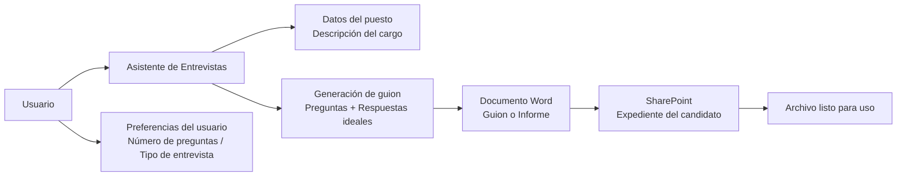
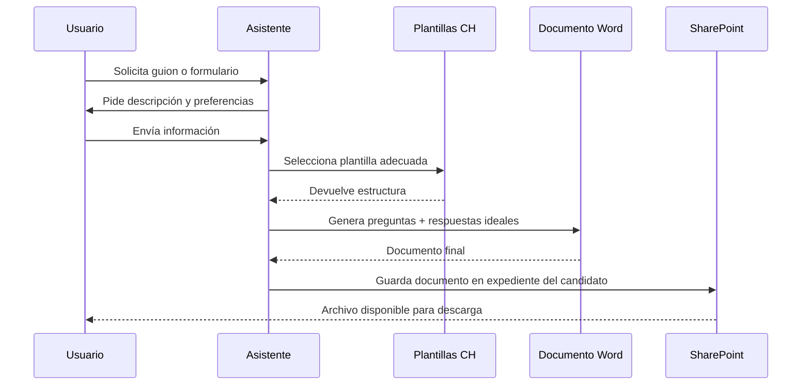

<p align="center">
  
</p>

# 🤖 Asistente de Entrevistas — Gerencia de Administración y Capital Humano


> El **Asistente de Entrevistas** es un **agente institucional desarrollado en Copilot Studio** para la **Gerencia de Administración y Capital Humano**, con el objetivo de automatizar la **generación de guiones, formularios y reportes de entrevistas**, reduciendo carga manual y asegurando consistencia en los procesos de reclutamiento y selección.

Responsable institucional: **DANIELA RONDÓN**  


---

## 🧭 Tabla de contenidos

- [¿Qué hace el Asistente de Entrevistas?](#que-hace-el-asistente-de-entrevistas)
- [Contexto y necesidad](#contexto-y-necesidad)
- [Historia y desarrollo](#historia-y-desarrollo)
- [Arquitectura y funcionamiento](#arquitectura-y-funcionamiento)
- [Guía de prompts](#guia-de-prompts)
- [Pruebas y calidad](#pruebas-y-calidad)
- [FAQ](#faq)
- [Licencia](#licencia)

---

## 🧩 ¿Qué hace el Asistente de Entrevistas?
<a id="que-hace-el-asistente-de-entrevistas"></a>

### 🎤 Genera guiones personalizados para entrevistas
Basados en:

- Descripción del cargo  
- Competencias corporativas  
- Preguntas técnicas  
- Situacionales y de comportamiento  

El usuario define:

- Número de preguntas  
- Tipo de entrevista  
- Plantilla deseada  

### 🧠 Genera **respuestas ideales** para cada pregunta
Incluye:

- Respuesta modelo  
- Explicación de criterios correctos  
- Señales positivas y de alerta  

### 📄 Crea documentos automáticamente
Compila preguntas y respuestas en un **Word institucional**, listo para expediente del candidato.

### 📝 Automatiza el llenado de formularios
Procesos incluidos:

- Solicitud de empleo  
- Información salarial  
- Informe de entrevista  
- Informe de selección  

---

## 🧠 Contexto y necesidad
<a id="contexto-y-necesidad"></a>

Antes del agente:

- Los analistas preparaban manualmente entrevistas y formularios.  
- Se redactaban reportes desde cero sin plantilla.  
- Había inconsistencia entre entrevistas similares.  

La necesidad institucional era:

- **Estandarizar entrevistas**
- **Ahorrar tiempo operativo**
- **Generar documentos automáticos**
- **Centralizar información en expedientes digitales**

Basado en documentos:  
*Paso a Paso.docx* — *Cambios_Minuta_Daniela_17072025.docx*

---

## 🛠️ Historia y desarrollo
<a id="historia-y-desarrollo"></a>

El agente fue desarrollado en colaboración con:

- **Daniela Rondón** (responsable de proceso)
- Laboratorio de Innovación (InnovaLab)

Fuentes utilizadas:

- Lineamientos corporativos de entrevistas  
- Plantillas institucionales de selección  
- Requerimientos legales y normativos  

Iteraciones realizadas:

- Ajuste de tono y estilo de preguntas  
- Inclusión de respuestas ideales  
- Diseño del Word final para expediente  
- Validaciones con usuarios de Capital Humano  


---

## 🧠 ¿Qué lo hace especial?

- Estándares homogéneos para todo el proceso de entrevistas  
- Preguntas basadas en competencias  
- Respuestas ideales explicadas  
- Generación automática de documentos  
- Integración completa con flujos M365  
- Facilita auditoría, trazabilidad y archivo digital  

---

## 🛠️ Arquitectura y funcionamiento
<a id="arquitectura-y-funcionamiento"></a>

### Vista general


```mermaid
flowchart LR
    U[Usuario] --> A[Asistente de Entrevistas]
    A --> D[Datos del puesto<br>Descripción del cargo]
    U --> P[Preferencias del usuario<br>Número de preguntas / Tipo de entrevista]
    A --> G[Generación de guion<br>Preguntas + Respuestas ideales]
    G --> W[Documento Word<br>Guion o Informe]
    W --> SP[SharePoint<br>Expediente del candidato]
    SP --> U2[Archivo listo para uso]
```

---

### Secuencia


```mermaid
sequenceDiagram
    participant Usuario
    participant Asistente
    participant Plantillas as Plantillas CH
    participant Word as Documento Word
    participant SP as SharePoint

    Usuario->>Asistente: Solicita guion o formulario
    Asistente->>Usuario: Pide descripción y preferencias
    Usuario->>Asistente: Envía información
    Asistente->>Plantillas: Selecciona plantilla adecuada
    Plantillas-->>Asistente: Devuelve estructura
    Asistente->>Word: Genera preguntas + respuestas ideales
    Word-->>Asistente: Documento final
    Asistente->>SP: Guarda documento en expediente del candidato
    SP-->>Usuario: Archivo disponible para descarga
```

---

## ✍️ Guía de prompts
<a id="guia-de-prompts"></a>

### ✔️ Rol del sistema
Agente institucional para automatizar entrevistas y formularios de selección.

### ✔️ Rol del usuario
Solicitar preguntas, respuestas ideales o documentos.

### ✔️ Restricciones
- Mantener tono profesional, corporativo y neutral.  
- Utilizar solo plantillas oficiales.  
- No generar preguntas discriminatorias.  

**Ejemplo de prompt interno:**

```md
Eres el Asistente de Entrevistas para Capital Humano.
Generas guiones, preguntas, respuestas ideales y documentos institucionales
basados en la descripción del puesto y lineamientos corporativos.
Debes mantener un estilo formal y profesional.
```

---

## ✅ Pruebas y calidad
<a id="pruebas-y-calidad"></a>

- Verificación de preguntas vs competencias corporativas  
- Calidad de respuestas ideales  
- Alineación con *Paso a Paso.docx*  
- Validación del documento Word final  
- Pruebas de integración con SharePoint  
- Revisión por **Daniela Rondón**  

---

## ❓ FAQ
<a id="faq"></a>

**¿Puede generar entrevistas técnicas?**  
Sí, si el usuario provee descripción o requisitos.

**¿Genera respuestas ideales automáticamente?**  
Sí, basadas en criterios de alta calidad.

**¿Dónde se guarda el documento?**  
En el expediente del candidato en SharePoint.

**¿Es posible personalizar el número de preguntas?**  
Totalmente.

---

## 📄 Licencia
<a id="licencia"></a>

Proyecto bajo licencia **MIT**. Consulta `LICENSE`.

---

### Créditos
Hecho con ❤️ por Christopher Acosta, Daniela Rondón y el Laboratorio de Innovación (InnovaLab).
