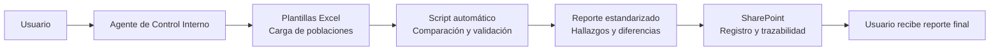
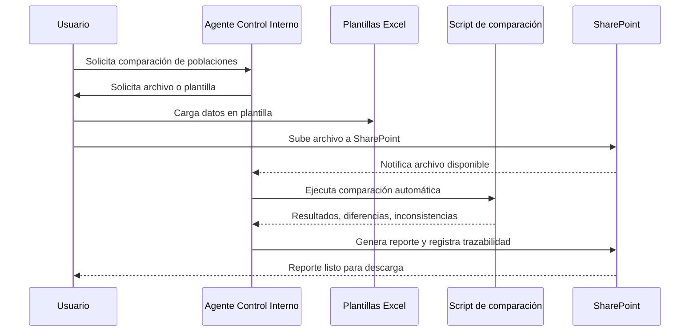

  

# 🤖 Agente de Control Interno — Dirección de Riesgo de Mercado, Operacional y Control Interno

> El **Agente de Control Interno** es una solución institucional creada en **Copilot Studio** para automatizar procesos clave de auditoría y control, reduciendo la carga manual en la comparación de poblaciones, validación de datos y generación de reportes auditables.

Responsable del proceso: **Lucia Da Costa**  
Estado: **Entregado y operativo**, con acceso a carpeta SharePoint (plantillas, scripts y manual de uso).

---

## 🧭 Tabla de contenidos

- [¿Qué hace el Agente de Control Interno?](#que-hace-el-agente-de-control-interno)
- [Contexto y necesidad](#contexto-y-necesidad)
- [Historia y desarrollo](#historia-y-desarrollo)
- [Arquitectura y funcionamiento](#arquitectura-y-funcionamiento)
- [Guía de prompts](#guia-de-prompts)
- [Pruebas y calidad](#pruebas-y-calidad)
- [FAQ](#faq)
- [Licencia](#licencia)

---

## 🧩 ¿Qué hace el Agente de Control Interno?

### 📊 Comparación automática de poblaciones
El agente:

- Recibe archivos Excel cargados por el usuario.  
- Ejecuta scripts internos para comparar poblaciones.  
- Identifica diferencias, inconsistencias y registros faltantes.  

### 🧪 Validación estructurada de datos
Aplica reglas automáticas para revisar:

- Campos obligatorios  
- Formatos incorrectos  
- Duplicados  
- Trazabilidad de cambios  

### 📝 Generación de reportes auditables
Produce reportes claros y estandarizados para:

- Auditorías internas  
- Auditorías externas  
- Reportes regulatorios  

Cada reporte incluye registros detallados y hallazgos documentados.

---

## 🧠 Contexto y necesidad

Antes de este agente:

- La comparación de poblaciones se hacía manualmente en Excel.  
- Las validaciones requerían análisis extensos por parte del equipo.  
- Era difícil garantizar trazabilidad y reproducibilidad.  

El problema principal: **altos tiempos operativos y riesgo de error humano**.

**Objetivo institucional:** Automatizar procesos críticos de control interno y auditoría.

Confirmado en reuniones y correos con **Lucia Da Costa**, quien validó:

- Plantillas oficiales  
- Script de comparación  
- Manual de uso  
- Carpeta SharePoint para almacenamiento y trabajo colaborativo  

---

## 🛠️ Historia y desarrollo

El agente fue desarrollado en conjunto con:

- Dirección de Riesgo de Mercado, Operacional y Control Interno  
- InnovaLab  

Iteraciones incluyeron:

- Ajustes a la plantilla Excel  
- Revisión del script de comparación  
- Validación del formato de los reportes  
- Pruebas con casos reales de auditoría  

El agente está **operativo y entregado**, listo para uso por los analistas y auditores.

---

## 🧠 ¿Qué lo hace especial?

* Reemplaza procesos manuales de alto riesgo  
* Comparación automatizada con precisión consistente  
* Reportes estructurados y trazables  
* Integración con flujos M365 / SharePoint  
* Puede extenderse a múltiples tipos de poblaciones o controles  

---

## 🛠️ Arquitectura y funcionamiento

### Vista general

```mermaid
flowchart LR
    U[Usuario] --> C[Agente de Control Interno]
    C --> X[Plantillas Excel<br>Carga de poblaciones]
    X --> S[Script automático<br>Comparación y validación]
    S --> R[Reporte estandarizado<br>Hallazgos y diferencias]
    R --> SP[SharePoint<br>Registro y trazabilidad]
    SP --> U2[Usuario recibe reporte final]
```

---

### Secuencia

```mermaid
sequenceDiagram
    participant Usuario
    participant Agente as Agente Control Interno
    participant Excel as Plantillas Excel
    participant Script as Script de comparación
    participant SP as SharePoint

    Usuario->>Agente: Solicita comparación de poblaciones
    Agente->>Usuario: Solicita archivo o plantilla
    Usuario->>Excel: Carga datos en plantilla
    Usuario->>SP: Sube archivo a SharePoint
    SP-->>Agente: Notifica archivo disponible
    Agente->>Script: Ejecuta comparación automática
    Script-->>Agente: Resultados, diferencias, inconsistencias
    Agente->>SP: Genera reporte y registra trazabilidad
    SP-->>Usuario: Reporte listo para descarga
```

---

## ✍️ Guía de prompts

### ✔️ Rol del sistema
Agente institucional para automatización de controles, auditoría operativa y validación de poblaciones.

### ✔️ Rol del usuario
Cargar plantillas Excel, solicitar comparaciones, revisar reportes.

### ✔️ Restricciones
- Seguir estructura oficial de reportes  
- No improvisar reglas de validación  
- Usar únicamente scripts y plantillas aprobadas  

---

## ✅ Pruebas y calidad

* Pruebas funcionales con poblaciones reales  
* Validación del script de comparación  
* Evaluación de rendimiento con archivos extensos  
* Revisión de reportes por auditores internos  
* Verificación de trazabilidad en SharePoint  
* Validación final por **Lucia Da Costa**  

---

## ❓ FAQ

**¿El agente compara cualquier archivo Excel?**  
Debe seguir la plantilla oficial.

**¿El reporte es automático?**  
Sí. El agente genera un reporte estructurado con diferencias e inconsistencias.

**¿Se puede auditar el proceso?**  
Sí. Todo queda registrado en SharePoint.

**¿Puede crecer a otros controles?**  
Totalmente. La arquitectura admite nuevos scripts y reglas de validación.

---

## 📄 Licencia

Este proyecto está bajo la licencia **MIT**. Consulta `LICENSE`.

---

### Créditos
Hecho con ❤️ por Raymond Arteaga y la Dirección de Riesgo de Mercado, Operacional y Control Interno.
