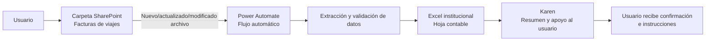
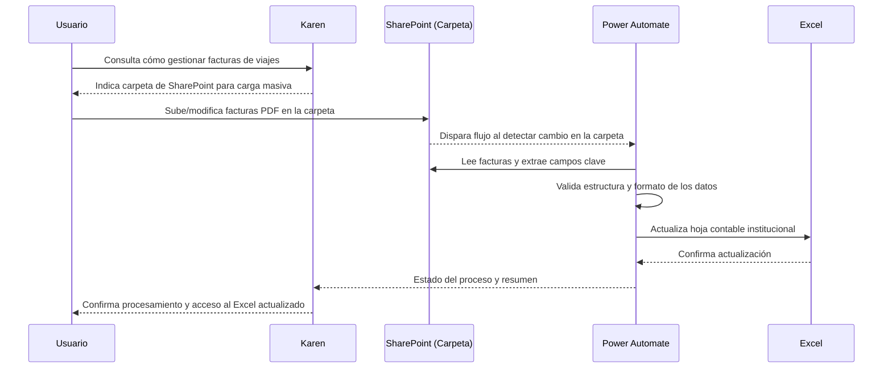

<p align="center">
  
</p>

# 🤖 Karen: Agente de Gestión de Facturas de Viajes


> **Karen** es un **agente institucional desarrollado en Copilot Studio** para automatizar la **gestión de facturas de viajes**, optimizando la carga, validación y consolidación de datos contables en los procesos internos de CAF.

---

👉 **Si quieres descargar un agente y editarlo en tu propio Copilot Studio**, por favor escribe a [innovacion@caf.com](mailto:innovacion@caf.com).  
El equipo de Innovación te compartirá los archivos y la configuración necesarios.

---

## 🧭 Tabla de contenidos

- [¿Qué hace Karen?](#que-hace-karen)
- [Historia y desarrollo](#historia-y-desarrollo)
- [Arquitectura y funcionamiento](#arquitectura-y-funcionamiento)
- [Guía de prompts](#guia-de-prompts)
- [Pruebas y calidad](#pruebas-y-calidad)
- [FAQ](#faq)
- [Licencia](#licencia)

---

## 🧩 ¿Qué hace Karen?
<a id="que-hace-karen"></a>

### 🔍 Extracción automática de datos desde facturas PDF
Karen forma parte de un flujo automatizado que identifica y estructura campos claves como:

- Número de factura  
- Fecha de emisión  
- Nombre del pasajero  
- Nombre y RUC del emisor  
- Descripción del servicio  
- Total a pagar y moneda  
- Número de CMB  
- Fecha del viaje  
- Medio de pago  
- Observaciones  

La extracción se realiza de forma **automática** cada vez que se agrega, modifica o actualiza un archivo en la carpeta de SharePoint definida para el proceso.

### 📂 Carga masiva en SharePoint  
El usuario puede cargar **varias facturas simultáneamente** en la carpeta de SharePoint configurada.  
Cada vez que se agrega o modifica un archivo, el flujo se **activa automáticamente**, sin intervención manual adicional.

### 📊 Actualización automática en Excel institucional  
El flujo procesa los datos extraídos y los refleja en el **Excel institucional contable** en **menos de 5 minutos**, manteniendo la información consolidada y actualizada.

### 🧠 Entrenamiento adaptable  
El flujo puede reconocer **nuevos formatos de facturas** sin necesidad de rehacer todo el diseño, permitiendo ajustarse a variantes de proveedores, agencias o aerolíneas.

---

## 🛠️ Historia y desarrollo
<a id="historia-y-desarrollo"></a>

* Karen surge como respuesta a la necesidad del área contable de **agilizar la gestión de facturas de viajes** y reducir errores de transcripción manual.  
* El agente y su flujo asociado fueron desarrollados en colaboración con **Karen Castañeda**, quien validó el comportamiento del sistema y las mejoras en tiempos de cierre.  
* Durante las iteraciones se realizaron ajustes clave:  
  - Reducción de notificaciones por correo para evitar saturación.  
  - Acceso directo a la carpeta de SharePoint indicada por el usuario para **carga masiva eficiente**.  
  - Activación automática del flujo cuando se **agrega, modifica o actualiza** un archivo en dicha carpeta.  
* El resultado fue una mejora notable en la **eficiencia del proceso** y en la **experiencia del usuario** contable.

---

## 🧠 ¿Qué lo hace especial?

* Automatiza completamente un proceso contable crítico, desde la carga hasta el registro.  
* Reduce drásticamente errores de transcripción manual.  
* Se integra de forma natural con herramientas **M365** (Teams, SharePoint, Excel y Power Automate).  
* Se activa automáticamente ante cambios en la carpeta de trabajo, reduciendo fricción operativa.  
* Es escalable a otros tipos de facturas o procesos contables similares.

---

## 🛠️ Arquitectura y funcionamiento
<a id="arquitectura-y-funcionamiento"></a>

### Vista general


```mermaid
flowchart LR
    U[Usuario] --> SP[Carpeta SharePoint<br>Facturas de viajes]
    SP -->|Nuevo/actualizado/modificado archivo| PA[Power Automate<br>Flujo automático]
    PA --> X[Extracción y validación de datos]
    X --> E[Excel institucional<br>Hoja contable]
    E --> K[Karen<br>Resumen y apoyo al usuario]
    K --> U2[Usuario recibe confirmación<br>e instrucciones]
```

---

### Secuencia


```mermaid
sequenceDiagram
    participant Usuario
    participant Karen
    participant SP as SharePoint (Carpeta)
    participant PA as Power Automate
    participant Excel

    Usuario->>Karen: Consulta cómo gestionar facturas de viajes
    Karen-->>Usuario: Indica carpeta de SharePoint para carga masiva
    Usuario->>SP: Sube/modifica facturas PDF en la carpeta
    SP-->>PA: Dispara flujo al detectar cambio en la carpeta
    PA->>SP: Lee facturas y extrae campos clave
    PA->>PA: Valida estructura y formato de los datos
    PA->>Excel: Actualiza hoja contable institucional
    Excel-->>PA: Confirma actualización
    PA-->>Karen: Estado del proceso y resumen
    Karen-->>Usuario: Confirma procesamiento y acceso al Excel actualizado
```

---

## ✍️ Guía de prompts
<a id="guia-de-prompts"></a>

* **Rol del sistema**: Agente institucional para automatización contable y apoyo en la gestión de facturas de viajes.  
* **Rol del usuario**: Consulta cómo cargar, revisar o validar facturas y resultados del flujo.  
* **Restricciones**:  
  * Responder únicamente con procesos oficiales definidos por el área contable.  
  * Guiar siempre al usuario hacia la carpeta de SharePoint y el Excel institucional configurados.  

**Plantilla ejemplo del prompt utilizado:**

```md
Eres Karen, un agente institucional para gestión automatizada de facturas de viajes.
Objetivo: guiar al usuario en la carga de facturas, explicar el funcionamiento del flujo automático
y ayudarle a acceder a los resultados en el Excel institucional.
Formato: respuestas claras, institucionales y orientadas al paso a paso.
Fuentes: Carpeta de SharePoint oficial definida para facturas y Excel institucional contable.
```

---

## ✅ Pruebas y calidad
<a id="pruebas-y-calidad"></a>

* **Pruebas funcionales**: verificación de extracción correcta de todos los campos contables definidos.  
* **Pruebas con facturas reales**: distintos formatos de proveedores, agencias y aerolíneas.  
* **Pruebas de rendimiento**: validación de tiempos de actualización (menos de 5 minutos desde la carga/modificación en la carpeta).  
* **Pruebas de disparador**: confirmación de que el flujo se activa al **agregar, modificar o actualizar** un archivo en la carpeta configurada.  
* **Revisión manual** por el equipo contable y por **Karen Castañeda**.  

---

## ❓ FAQ
<a id="faq"></a>

**¿Qué facturas procesa Karen?**  
Facturas de viajes en formato PDF cargadas en la carpeta de SharePoint configurada para el proceso.

**¿Es necesario ejecutar algo manualmente cada vez?**  
No. El flujo se **activa automáticamente** cuando se agrega, modifica o actualiza un archivo en la carpeta definida.

**¿Actualiza automáticamente el Excel institucional?**  
Sí. Cada ejecución del flujo actualiza la hoja contable institucional con los datos extraídos.

**¿Puede adaptarse a otros procesos contables?**  
Sí, gracias a su arquitectura modular basada en Power Automate y su capacidad de adaptación a nuevos formatos.

**¿Dónde se almacena la información?**  
En **SharePoint institucional** (facturas y control de versiones) y en el **Excel contable oficial** (consolidación de datos).

---

## 📄 Licencia
<a id="licencia"></a>

Este proyecto está bajo la licencia **MIT**. Consulta `LICENSE`.

---

### Créditos

Hecho con ❤️ por Raymond Arteaga y Karen Castañeda.
