<p align="center">
  
</p>

# 🤖 Gloria: Agente de Resúmenes Ejecutivos


> **Gloria** es un **agente institucional desarrollado en Copilot Studio** para apoyar la generación, validación y estructuración de **resúmenes ejecutivos** en operaciones de cooperación técnica, comités y proyectos regionales.

---

👉 **Si quieres descargar un agente y editarlo en tu propio Copilot Studio**, por favor escribe a [innovacion@caf.com](mailto:innovacion@caf.com).  
El equipo de Innovación te compartirá los archivos y la configuración necesarios.

---

## 📹 Demo rápida (Prueba del Agente)

<p><a href="https://teams.microsoft.com/l/app/f6405520-7907-4464-8f6e-9889e2fb7d8f?templateInstanceId=7e1845a7-b8e1-46e4-9cac-7e653f91ef5b&environment=Default-863e38af-aa47-45c7-a525-20465c654244" target="_blank" rel="noopener noreferrer">
👉 Abrir demo en una nueva pestaña
</a></p>

---


## 🧭 Tabla de contenidos

- [¿Qué hace Gloria?](#que-hace-gloria)
- [Historia y desarrollo](#historia-y-desarrollo)
- [Arquitectura y funcionamiento](#arquitectura-y-funcionamiento)
- [Guía de prompts](#guia-de-prompts)
- [Despliegue en Copilot Studio](#despliegue-en-copilot-studio-m365--teams--sharepoint)
- [Pruebas y calidad](#pruebas-y-calidad)
- [FAQ](#faq)
- [Licencia](#licencia)

---

## 🧩 ¿Qué hace Gloria?
<a id="que-hace-gloria"></a>

* Extrae y organiza información clave de **documentos técnicos y operativos**.  
* Genera **resúmenes ejecutivos estandarizados** con campos como país, cliente, monto, plazo, modalidad, objetivos y situación actual.  
* Facilita la revisión por parte de **comités y gerencias**.  
* Se alimenta de documentos institucionales como *PE 1631-2025*, *8. RESUMEN EJECUTIVO OIM_vf* y *PE-1170-2024*.  
* Puede integrarse con **SharePoint** para flujos de validación y almacenamiento.  

---

## 🛠️ Historia y desarrollo
<a id="historia-y-desarrollo"></a>

* Surge como parte del proyecto de **automatización de resúmenes ejecutivos**.  
* Se apoya en documentos redactados por **Gloria Betancourt**, quien ha generado múltiples resúmenes para operaciones regionales en temas de migración, género y licitaciones.  
* Su diseño y funcionalidades fueron discutidas en reuniones pautadas con Alberto Leañez.
* Está vinculado a iniciativas de cooperación técnica y validación documental.  

---

## 🧠 ¿Qué lo hace especial?

* **Estandariza** la presentación de operaciones para facilitar su aprobación.  
* Permite generar resúmenes desde **documentos PDF** cargados por el usuario.  
* Puede adaptarse a diferentes sectores: **género, migración, licitaciones, cooperación técnica**.  
* Utiliza **plantillas institucionales** y puede integrarse con flujos de **validación automática** en SharePoint.  

---

## 🛠️ Arquitectura y funcionamiento
<a id="arquitectura-y-funcionamiento"></a>

### Vista general

```mermaid
flowchart LR
    U[Usuario] --> G[Gloria]
    G --> O[Oferta: crear resumen ejecutivo]
    O --> U2[Usuario acepta]
    U2 --> D[Usuario carga PDF]
    D --> G
    G --> A[Análisis con prompt]
    A --> W[Generación de Word]
    W --> E[Envío por correo electrónico]
    E --> U
```



### Secuencia

```mermaid
sequenceDiagram
    participant Usuario
    participant Gloria
    participant PDF as Documento PDF
    participant Word as Archivo Word
    participant Email as Correo Electrónico

    Usuario->>Gloria: Inicia conversación
    Gloria->>Usuario: Ofrece crear resumen ejecutivo
    Usuario->>Gloria: Acepta hacer el resumen
    Usuario->>Gloria: Carga Documento PDF
    Gloria->>PDF: Analiza contenido con prompt
    Gloria->>Word: Genera resumen estructurado
    Word-->>Gloria: Documento final listo
    Gloria->>Email: Envía resumen ejecutivo al usuario
    Email-->>Usuario: Recibe el Word con el resumen
```



---

## ✍️ Guía de prompts
<a id="guia-de-prompts"></a>

* **Rol del sistema**: Agente institucional para generación de resúmenes ejecutivos.  
* **Rol del usuario**: Carga documentos técnicos o solicita resumen ejecutivo.  
* **Restricciones**:  
  * Solo responder con los campos oficiales de la plantilla institucional.  
  * Para detalles adicionales, consultar SharePoint.  

**Plantilla ejemplo de prompt utilizado:**

```md
Eres Gloria, un agente institucional para resúmenes ejecutivos.
Objetivo: generar resúmenes claros y estructurados de operaciones CAF.
Formato: campos estandarizados + descripción técnica.
Fuentes: documentos institucionales y SharePoint.
```

---

## 🚀 Despliegue en Copilot Studio (M365 + Teams + SharePoint)
<a id="despliegue-en-copilot-studio-m365--teams--sharepoint"></a>

1. Crea o selecciona tu agente en **Copilot Studio**.  
2. Configura flujo de carga de documentos.  
3. Integra con **SharePoint** para plantillas y validación.  
4. Prueba en *Test Canvas*, Teams y SharePoint.  
5. Publica en canal institucional.  

---

## ✅ Pruebas y calidad
<a id="pruebas-y-calidad"></a>

* **Validación de campos obligatorios**: país, cliente, monto, modalidad, objetivos.  
* **Pruebas con documentos reales**: *PE 1631-2025* y *8. RESUMEN EJECUTIVO OIM_vf*.  
* **Revisión manual** por el equipo de **Gloria Betancourt** para confirmar la fidelidad de la información.  

---

## ❓ FAQ
<a id="faq"></a>

**¿Qué tipo de documentos procesa Gloria?**  
Documentos técnicos, operativos y de cooperación técnica.  

**¿Puede generar resúmenes automáticamente?**  
Sí, a partir de documentos PDF estructurados.  

**¿Dónde se guarda la información?**  
En **SharePoint institucional** y en **Copilot Studio**.  

---

## 📄 Licencia
<a id="licencia"></a>

Este proyecto está bajo la licencia **MIT**. Consulta `LICENSE`.  

---

### Créditos

Hecho con ❤️ por Christopher Acosta y Raymond Arteaga.
