<p align="center">
  
</p>

# 🤖 Lya: Agente de asistencia de DSLA


> **Lya** es un **agente institucional desarrollado en Copilot Studio** para la DSLA. Su función principal es responder consultas sobre los servicios logísticos y administrativos, y derivar la atención a **sub-agentes especializados por servicio**.

---

👉 **Si quieres descargar un agente y editarlo en tu propio Copilot Studio**, por favor escribe a [innovacion@caf.com](mailto:innovacion@caf.com).  
El equipo de Innovación te compartirá los archivos y la configuración necesarios.

---

## 📹 Demo rápida (Prueba del Agente)

* **Agente**:  
https://teams.microsoft.com/l/app/f6405520-7907-4464-8f6e-9889e2fb7d8f?templateInstanceId=a5d131aa-4313-4a37-9f17-f550dbe42b3a&environment=Default-863e38af-aa47-45c7-a525-20465c654244

---

## 🧭 Tabla de contenidos

- [¿Qué hace Lya?](#que-hace-lya)
- [Historia y desarrollo](#historia-y-desarrollo)
- [Arquitectura y funcionamiento](#arquitectura-y-funcionamiento)
- [Guía de prompts](#guia-de-prompts)
- [Despliegue en Copilot Studio](#despliegue-en-copilot-studio-m365--teams--sharepoint)
- [Pruebas y calidad](#pruebas-y-calidad)
- [FAQ](#faq)
- [Licencia](#licencia)

---

## 🧩 ¿Qué hace Lya?
<a id="que-hace-lya"></a>

* Muestra información de los servicios que ofrece la **DSLA**.
* Crea un **sub-agente por cada servicio**, permitiendo modularizar la atención.
* Funciona como un asistente institucional formal, cálido y profesional.
* Personaliza respuestas incluyendo el **nombre del usuario**.
* Presenta antes de cada respuesta un **resumen en lista de temas**.
* Responde únicamente con los servicios oficiales de la DSLA.
* Consulta información exclusiva del **SharePoint institucional** para dar más detalles.

---

## 🛠️ Historia y desarrollo
<a id="historia-y-desarrollo"></a>

* Lya está registrada como **AI-DSLA-01** en el archivo institucional de agentes.
* Se desarrolló como parte de las iniciativas de **agentes institucionales en Copilot Studio**.
* Fue creado de manera colaborativa, con participación de **Raymond Arteaga**, **Braulio Salazar** y el equipo DSLA.
* El proyecto evolucionó a través de correos, notas técnicas y archivos compartidos, con iteraciones frecuentes.

---

## 🧠 ¿Qué lo hace especial?

* Estilo formal, cálido y profesional.
* Respuestas personalizadas con el nombre del usuario.
* Uso de fuentes oficiales (imagen institucional de la DSLA y SharePoint).
* Modularización en sub-agentes para cada servicio, lo que facilita la escalabilidad.

---

## 🛠️ Arquitectura y funcionamiento
<a id="arquitectura-y-funcionamiento"></a>

### Vista general

```mermaid
flowchart LR
    U[Usuario] --> P[Pregunta]
    P --> L[Lya]
    L -->|Derivación| S[Sub-agente de servicio]
    S --> R[Respuesta especializada]
    R --> U
```



### Secuencia

```mermaid
sequenceDiagram
    participant Usuario
    participant Lya
    participant Sub as Sub-agente
    participant SP as SharePoint

    Usuario->>Lya: Consulta sobre un servicio
    Lya->>Sub: Redirige según servicio
    Sub->>SP: Consulta fuente oficial
    SP-->>Sub: Información validada
    Sub-->>Usuario: Respuesta clara y formal
```



---

## ✍️ Guía de prompts
<a id="guia-de-prompts"></a>

* **Rol del sistema**: Mantener estilo institucional, cálido y formal.
* **Rol del usuario**: Consulta sobre servicios DSLA.
* **Restricciones**:
  * Solo mostrar servicios listados en imagen institucional DSLA.
  * Para detalles adicionales, consultar SharePoint oficial.

**Plantilla ejemplo de los prompts utilizados para su creación:**

```md
Eres Lya, un agente institucional (AI-DSLA-01).
Objetivo: brindar información sobre servicios DSLA y derivar a sub-agentes.
Formato de salida: primero lista de temas a tratar, luego respuesta formal.
Fuentes: Imagen institucional DSLA y SharePoint oficial.
```

---

## 🚀 Despliegue en Copilot Studio (M365 + Teams + SharePoint)
<a id="despliegue-en-copilot-studio-m365--teams--sharepoint"></a>

1. Crea o selecciona tu agente en **Copilot Studio**.  
2. Agrega SharePoint como fuente de conocimiento.  
3. Configura los canales de publicación (Teams, M365, SharePoint, web).  
4. Prueba en *Test Canvas*, Teams y SharePoint.  
5. Publica para tu organización o canal.  

---

## ✅ Pruebas y calidad
<a id="pruebas-y-calidad"></a>

* **Validación de fuentes**: Solo responde con información DSLA oficial.
* **Pruebas de contrato**: Verifican estructura de respuesta (lista + texto formal).
* **Snapshots**: Para asegurar consistencia en estilo y tono.

---

## ❓ FAQ
<a id="faq"></a>

**¿Qué servicios cubre Lya?**  
Los servicios oficiales listados en la imagen institucional DSLA.

**¿De dónde obtiene la información?**  
Del SharePoint oficial DSLA y materiales institucionales.

---

## 📄 Licencia
<a id="licencia"></a>

Este proyecto está bajo la licencia **MIT**. Consulta `LICENSE`.

---

### Créditos

Hecho con ❤️ por Raymond Arteaga
