# 🤖 Lya: Agente de asistencia de DSLA


> **Lya** (AI-DSLA-01) es un **agente institucional desarrollado en Copilot Studio** para la DSLA. Su función principal es responder consultas sobre los servicios logísticos y administrativos, y derivar la atención a **sub-agentes especializados por servicio**.

---

## 📹 Demo rápida

* **Video/GIF**: `./media/demo.gif`
* **Demo en vivo**: [URL\_DEMO](https://example.com)

---

## 🧭 Tabla de contenidos

* [¿Qué hace Lya?](#-qué-hace-lya)
* [Historia y desarrollo](#-historia-y-desarrollo)
* [Arquitectura y funcionamiento](#-arquitectura-y-funcionamiento)
* [Guía de prompts](#-guía-de-prompts)
* [Despliegue en Copilot Studio](#-despliegue-en-copilot-studio)
* [Pruebas y calidad](#-pruebas-y-calidad)
* [Roadmap](#-roadmap)
* [Contribuir](#-contribuir)
* [FAQ](#-faq)
* [Licencia](#-licencia)

---

## 🧩 ¿Qué hace Lya?

* Muestra información de los servicios que ofrece la **DSLA**.
* Crea un **sub-agente por cada servicio**, permitiendo modularizar la atención.
* Funciona como un asistente institucional formal, cálido y profesional.
* Personaliza respuestas incluyendo el **nombre del usuario**.
* Presenta antes de cada respuesta un **resumen en lista de temas**.
* Responde únicamente con los servicios oficiales de la DSLA.
* Consulta información exclusiva del **SharePoint institucional** para dar más detalles.

---

## 🛠️ Historia y desarrollo

* Lya está registrada como **AI-DSLA-01** en el archivo institucional de agentes.
* Se desarrolló como parte de las iniciativas de **agentes institucionales en Copilot Studio**.
* Fue creado de manera colaborativa, con participación de **Raymond (autor principal)**, **Braulio Salazar (gerente)** y el equipo DSLA.
* El proyecto evolucionó a través de correos, notas técnicas y archivos compartidos, con iteraciones frecuentes.

---

## 🧠 ¿Qué lo hace especial?

* Estilo formal, cálido y profesional.
* Respuestas personalizadas con el nombre del usuario.
* Uso de fuentes oficiales (imagen institucional de la DSLA y SharePoint).
* Modularización en sub-agentes para cada servicio, lo que facilita la escalabilidad.

---

## 🛠️ Arquitectura y funcionamiento

### Vista general

```mermaid
flowchart LR
    U[Usuario] --> P[Pregunta]
    P --> L[Lya]
    L -->|Derivación| S[Sub-agente de servicio]
    S --> R[Respuesta especializada]
    R --> U
```



### Secuencia

```mermaid
sequenceDiagram
    participant Usuario
    participant Lya
    participant Sub as Sub-agente
    participant SP as SharePoint

    Usuario->>Lya: Consulta sobre un servicio
    Lya->>Sub: Redirige según servicio
    Sub->>SP: Consulta fuente oficial
    SP-->>Sub: Información validada
    Sub-->>Usuario: Respuesta clara y formal
```



---

## ✍️ Guía de prompts

* **Rol del sistema**: Mantener estilo institucional, cálido y formal.
* **Rol del usuario**: Consulta sobre servicios DSLA.
* **Restricciones**:

  * Solo mostrar servicios listados en imagen institucional DSLA.
  * Para detalles adicionales, consultar SharePoint oficial.

**Plantilla ejemplo:**

```md
Eres Lya, un agente institucional (AI-DSLA-01).
Objetivo: brindar información sobre servicios DSLA y derivar a sub-agentes.
Formato de salida: primero lista de temas a tratar, luego respuesta formal.
Fuentes: Imagen institucional DSLA y SharePoint oficial.
```

---

## 🚀 Despliegue en Copilot Studio

1. Importa el flujo JSON de `/agents/lya/flows/` en Copilot Studio.
2. Configura los sub-agentes para cada servicio DSLA.
3. Conecta el agente a SharePoint como fuente de conocimiento.
4. Prueba en *Test Canvas*.
5. Publica en canal (Teams/Web).

---

## ✅ Pruebas y calidad

* **Validación de fuentes**: Solo responde con información DSLA oficial.
* **Pruebas de contrato**: Verifican estructura de respuesta (lista + texto formal).
* **Snapshots**: Para asegurar consistencia en estilo y tono.

---

## 🗺️ Roadmap

* [ ] Añadir más sub-agentes de servicios.
* [ ] Integrar métricas de uso y satisfacción.
* [ ] Documentar casos de uso frecuentes.
* [ ] Mejorar personalización con metadatos del usuario.

---

## 🤝 Contribuir

1. Haz un *fork* y crea rama: `feature/mi-mejora`
2. Asegúrate que las pruebas pasan
3. Abre un *Pull Request* con descripción y ejemplos

---

## ❓ FAQ

**¿Qué servicios cubre Lya?**
Los servicios oficiales listados en la imagen institucional DSLA.

**¿De dónde obtiene la información?**
Del SharePoint oficial DSLA y materiales institucionales.

---

## 📄 Licencia

Este proyecto está bajo la licencia **MIT**. Consulta `LICENSE`.

---

### Créditos

Hecho con ❤️ por
